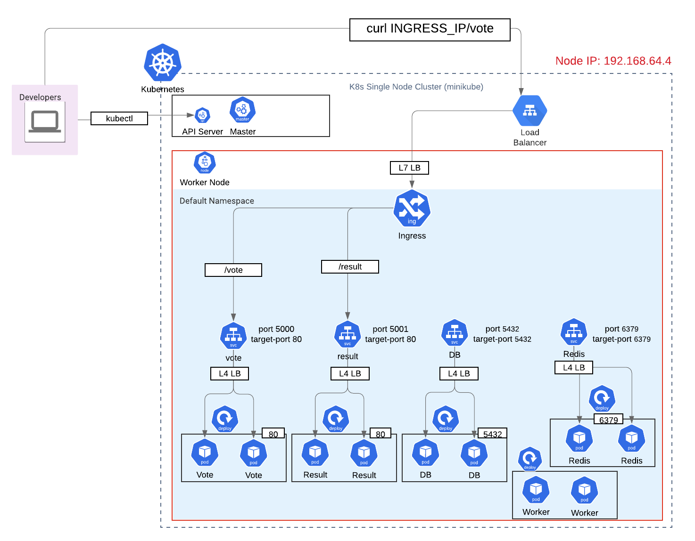

# このKubernetes完全入門コースを取るべき9個の理由

## 1. 現役アメリカシリコンバレーDevOpsエンジニアがレクチャー
このコースでは、カナダの大学をCS専攻で卒業し現在アメリカ企業でDevOpsエンジニアとしてKubernetesやDockerをゴリゴリ使っている現役DevOpsエンジニアが図解説で丁寧にレクチャーします

## 2. 理論（レクチャー）と実践（ハンズオンラボ）

理論だけ聞いてても眠くなります。実践的なハンズオンラボがあるので、コマンドを手を動かしながら学べます。

## 3. 抽象的でとっつきにくいコンセプトやアーキテクチャを図解説

コマンドだけでなく、基本から応用までの本質をダイアグラムで頭に残すので、今打っているコマンドが実際に何をしているのか理解しやすくなります。

## 4. デベロパー向けにLinuxの基本知識とコマンドを解説・デモ

わかりにくい・そして怖いあの黒いターミナル。元バックエンドデベロパー、そして現DevOpsエンジニアと一緒に学んだらもう怖くありません！：）

２ー３年前まで意味不明だったLinuxのコンセプトやコマンドを、「分からなかった目線」で解説するので安心です。

## 5. 北米・ヨーロッパでのDevOpsエンジニアの経験を凝縮

図解付きの丁寧な解説、Linuxの難しいコンセプト、K8sのネットワークダイアグラム、テストやデバッギング、ConfigMap、永続ボリューム、宣言的YAMLの簡単なデモまでの、デベロパーとして知っておくべき基礎を全て網羅しました。

## 6.　抽象度高めでわかりにくいK8sのネットワーキングを解説し、４つのパターン（ClusterIP, NodePort, LoadBalancer, Ingress）のテスト・デバッギングの仕方を図解説

個人的にK8sで一番難しいと思うネットワーキングを、図解でビジュアライズしながら学びます。このネットワーキングはTrafficがどう流れるのかを図で理解し、デバッギングやテストで役立ちます。

## 7. 命令的コマンド・宣言的なYAMLの比較をし、DevOpsプラクティスを実践

DevOpsのBest Practiceの1つであるIaC(Infrastructure as Code)の利点、実践的なコードに書き方などを紹介します。

## 8. Docker-Composeで定義されたWebアプリケーション（Nodejs + Python + Redis + Postgres + C#）をK8sの宣言的YAMLに変換し構築ができるようになります

Docker完全入門のコースのコーディングチャレンジで使ったサンプルアプリを元に、Docker ComposeのYAMLに基づいて今度はK8sのPod, Service, DeploymentのYAMLに変換しディプロイするコーディングチャレンジを追加。

## 9. 幅広いコースをたったの４時間以内に凝縮
講師である自分が学んでいたときのコースを選ぶ目安は、コースの長さでもありました。すでに仕事で忙しいエンジニアなので、10時間以上だとFocusが持たなかったり、冗長で端的にさくっとスパッと学べないことが多いです。そのため、いかに簡潔にコンパクトに学べるかを意識してこのコースを監修しました。週末にさくっと一気に学べます。