# 1. Intro

## 1. クーベネティス？何それ新種の恐竜？ (What is K8s?) 
`Kubernetes`: ギリシャ語で航海長・パイロット

このコースを学ぶ理由：
- Kubernetesをはじめるきっかけがない 
- Kubernetesの概要だけ知りたい
- Nodeってなに?
- Podってなに?
- Docker をローカルで動かすだけでなく、サーバー上で動かしてみたい
- オーケストレーションについて理解したい


## 2. Why K8s?

Official doc says “Kubernetesは、宣言的な構成管理と自動化を促進し、コンテナ化されたワークロードやサービスを管理するための、ポータブルで拡張性のあるオープンソースプラットホームです”.　専門用語の羅列では？って感じですよね？


- Dockerコンテナをクラスタ化した際の運用ツールの１つ
- マイクロサービスと相性が良い
- Dockerは、単一ホスト内の複数コンテナ同士はやりとりできるが、複数マシン上で外側とのやりとりにNATが必要
    - Docker は単一マシンの上で複数コンテナを動作させるシステムでしたが、kubernetes は複数マシン上でコンテナを管理・統合させるためのシステムです。コンテナオーケストレーションといいます。
- したがって、ホスト間の連携が煩雑になるため、容易にスケールアウトできない
- 複数台ホストの管理・統合させるためのシステムで, 構成される実行環境をあたかも一台の実行環境のように扱う

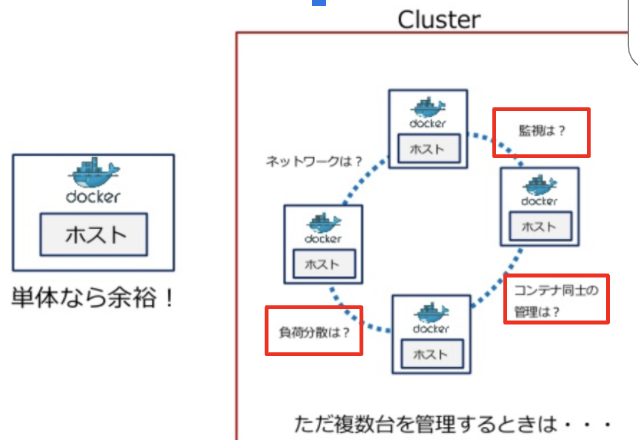

- K8sは毎年のように人気度が増えていて、2020年現在、インフラとDevelopmentを融和させるDevOpsという風潮の中では、なくてはならない存在です

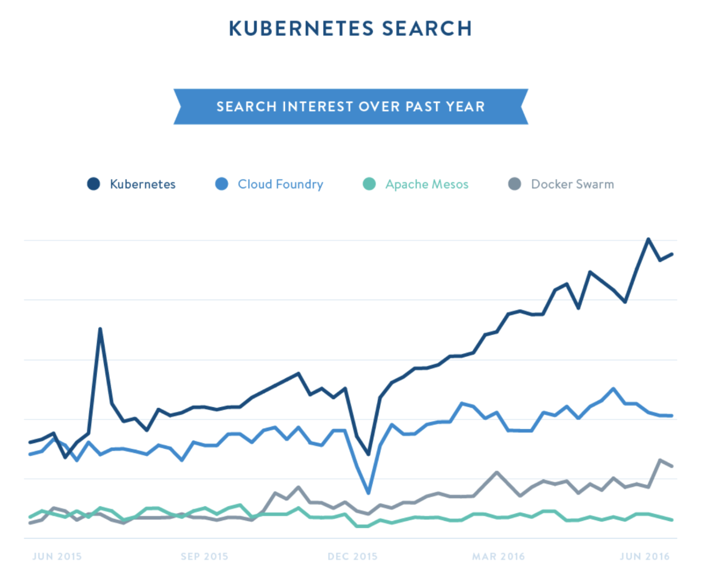

-　またコミュニティーも大きく、いろんなインテグレーションが可能です。
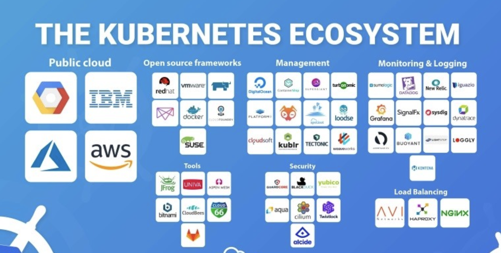


## 3. K8s Benefits
__アプリを迅速に予定通りにクラスターにデプロイする。また稼働中にアプリをスケールしたり、ローリングアップデート、自動修復もしてくれる__

BEFORE:
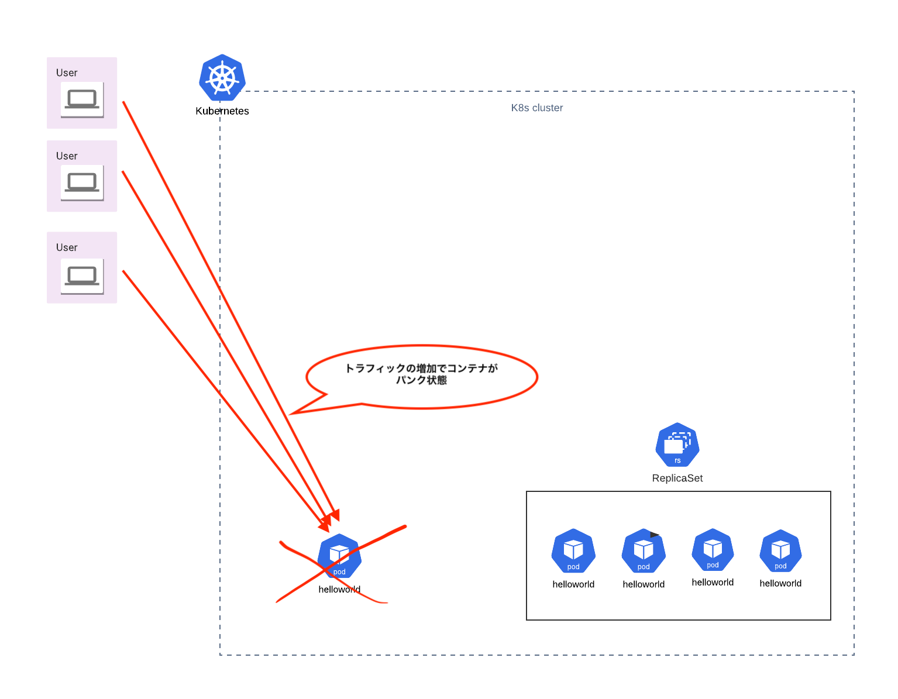

AFTER:
- 迅速に予定通りに自動配置デプロイ
- アプリのインスタンスの複製(配備と冗長化)
- コンテナの健全性のチェック(死活監視), コンテナのプロセスが停止した場合自動修復 (Self-healing – 耐障害性)、自動再起動
    - kubernetesはコンテナのプロセス監視を行なっており、コンテナのプロセスが停止した場合には、自動的に再デプロイできる

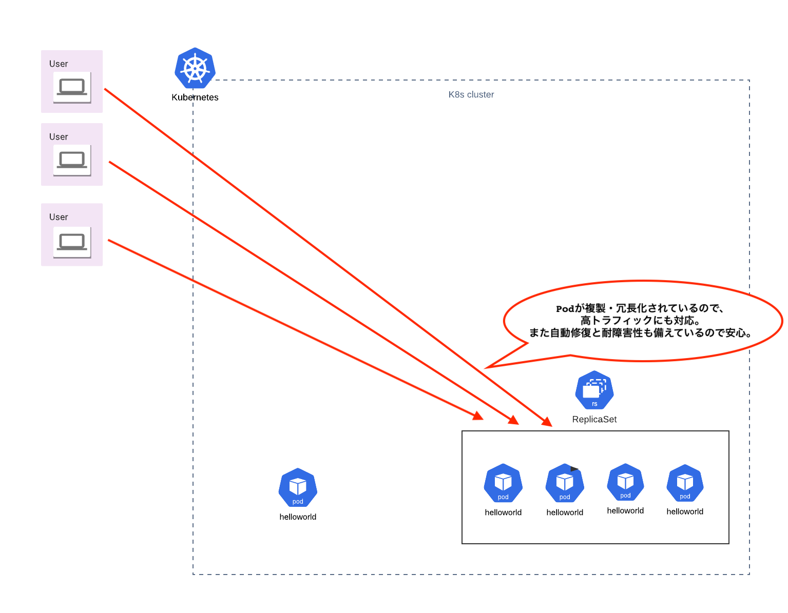

- 新機能をシームレスに提供開始する (ローリング・アップデート 無停止更新)
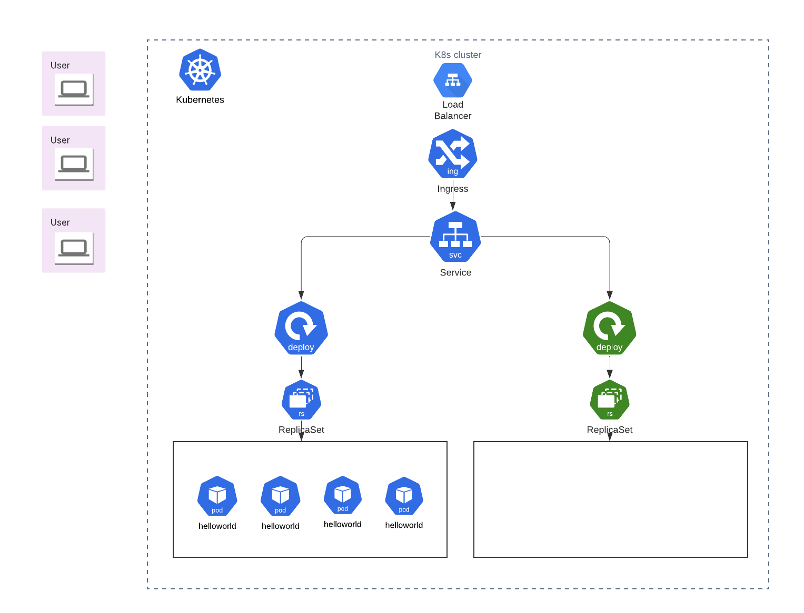
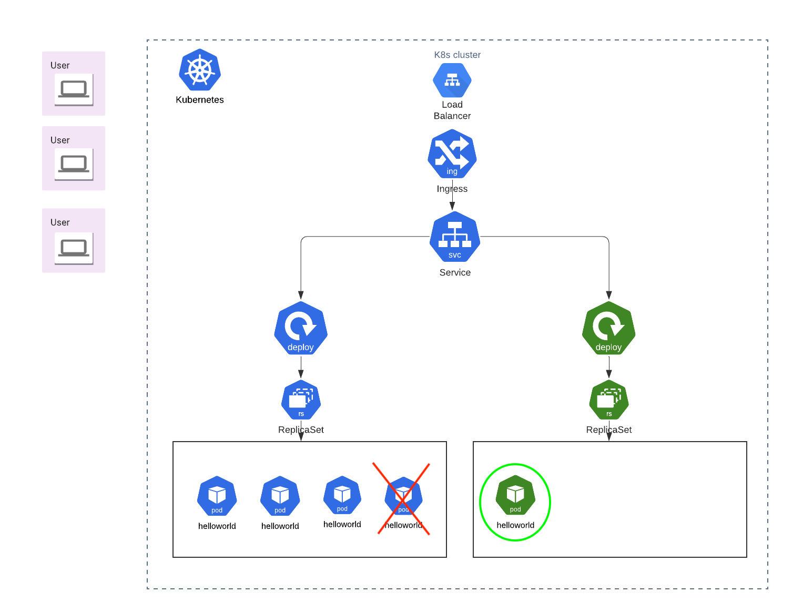
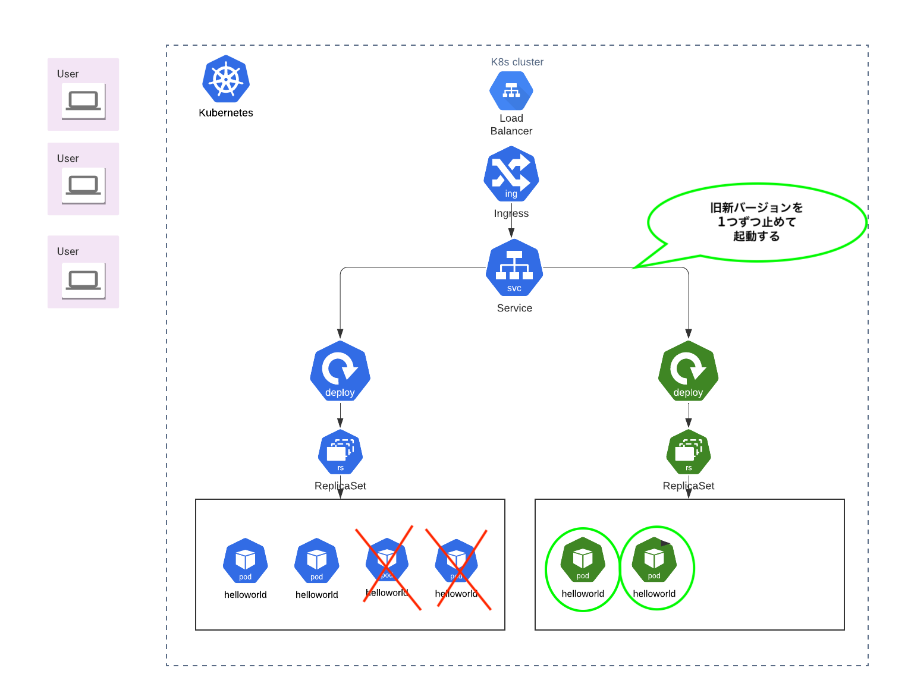
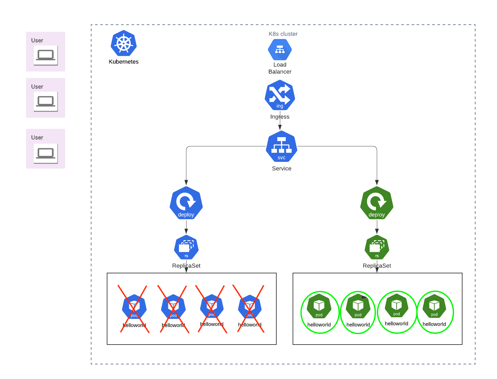


- 稼働中にアプリをスケールする (水平の自動スケーリング, CPU稼働率の閾値でコンテナ数を増減)
- 複数ホスト上の複数コンテナへのロードバランシング/ワークロードの分散 (service, L4 LB)
    - 障害時における切り離しや、ローリングアップデート時における事前の切り離しなども自動で行える
- ハードウェアの利用率を要求に制限する (コンテナで共存させて稼働率を高くする）
- 資源の監視 (metrics, prometheus, grafana)
- logs
- 認証と認可の提供 (AWS IAM integration, RBAC, service account)


## 4. Pre-Container vs Post-Container Deployment Method

__Deployする最小単位のアーティファクトが、従来のファイル(.war, .jar, .py, .js)やフォルダー(.zip)から、コンテナ（コード＋パッケージ）に代わり、OS環境問わず同一の動作をする__

__コンテナ化の例え__:
- 例えで言うと、引っ越しの時にダンボールで荷造りをすることで、業者が運びやすくなるのと似ています
- Dockerっていうのはコンテナという技術を使ってコードとライブラリーやパッケージをパッキングすることなんですね。

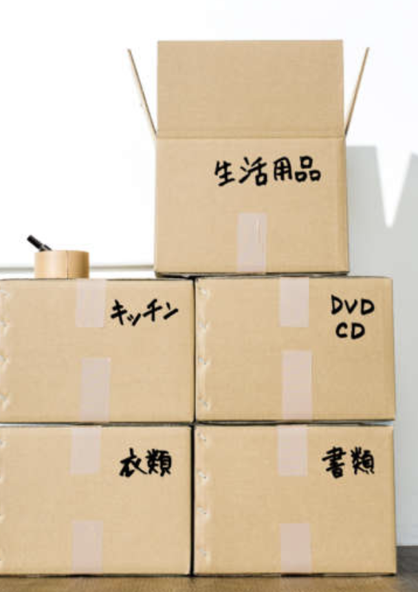
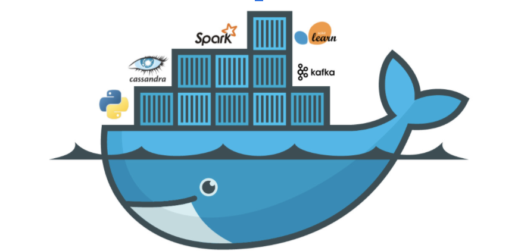

BEFORE:
- 今までは、ファイルやフォルダーをJenkinsなどのCICDパイプラインを使って、本番環境のサーバーにコピーしていました

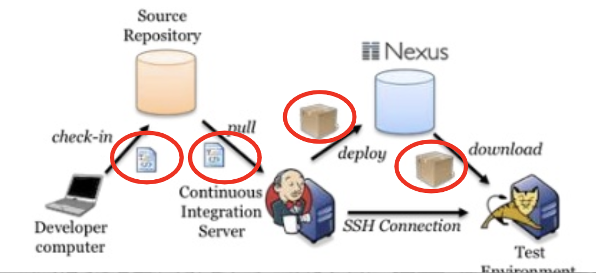

AFTER:
- ドッカーでは、コードとライブラリーをパッケージングしてdocker imageを作り、本番環境のサーバーにドッカーイメージをダウンロードして、それを実行するだけでOKになります
- つまりDeployする最小単位のアーティファクトが、コンテナ（コード＋パッケージ）に代わり、OS環境問わず同一の動作をするんですね

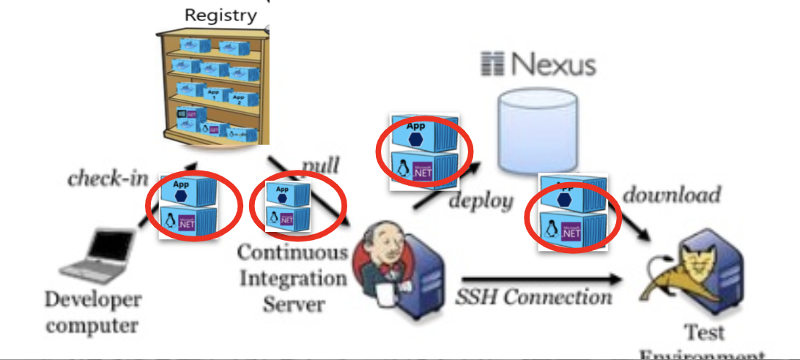


## 5. VM (virttualization) vs Container 

BEFORE:
- 従来の仮想化は、1つのOS上に複数の仮想OSを置いて，そこでアプリケーションを動かしていました

AFTER:
- ただDockerの場合は、1つのOSにDocker engineを起動して複数のコンテナを起動します

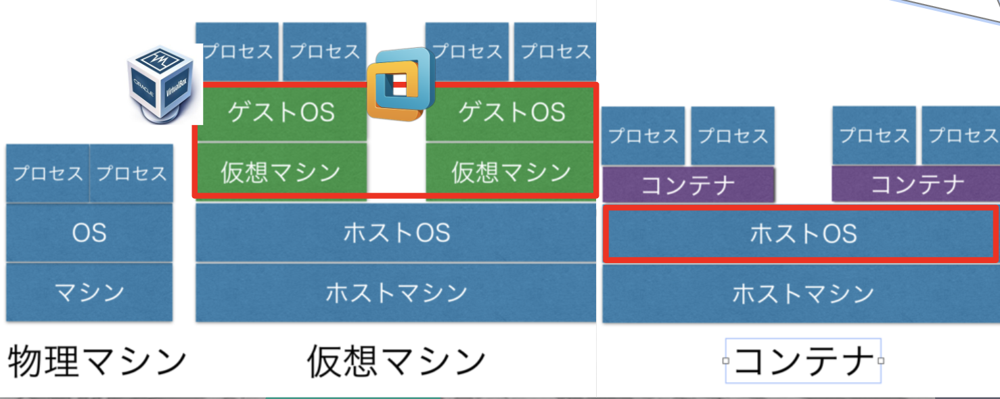

More Container Benefits:
- リソースが軽い
    - OSを複数使わない分オーバーヘッド（複数のOSイメージとカーネル）が減り、プロセッサやメモリの消費が少なくなります
- ストレージの使用量が減る
    - OSイメージの通常サイズが５−１０GBに対し、Docker Imageのサイズは1−２GBなのでストレージの使用量も減ります。
- 起動時間が速い
    - カーネルをいちいちロードする手間が省け、仮想マシンに比べて起動時間が短くなります
- 複数環境での運営が楽
    - DockerがインストールされてるOSならどこでもコンテナが起動できます。


## 6. Docker Image vs Docker Container vs K8s Pod

__イメージとコンテナの違いは、例えで言うと、ClassとObject、車の設計図と実際の車、のようにテンプレートvs実物と言う違いです__

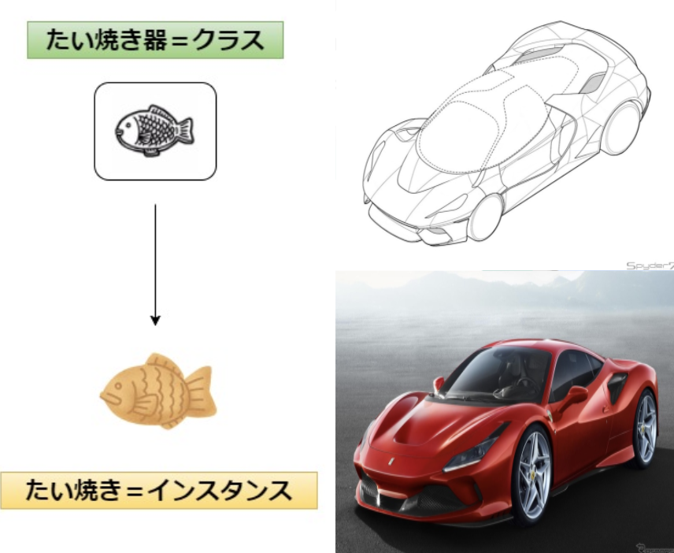


Dockerfileがやい焼き機の設計書、Dockerイメージがたい焼き機、コンテナが実際のたい焼きです。
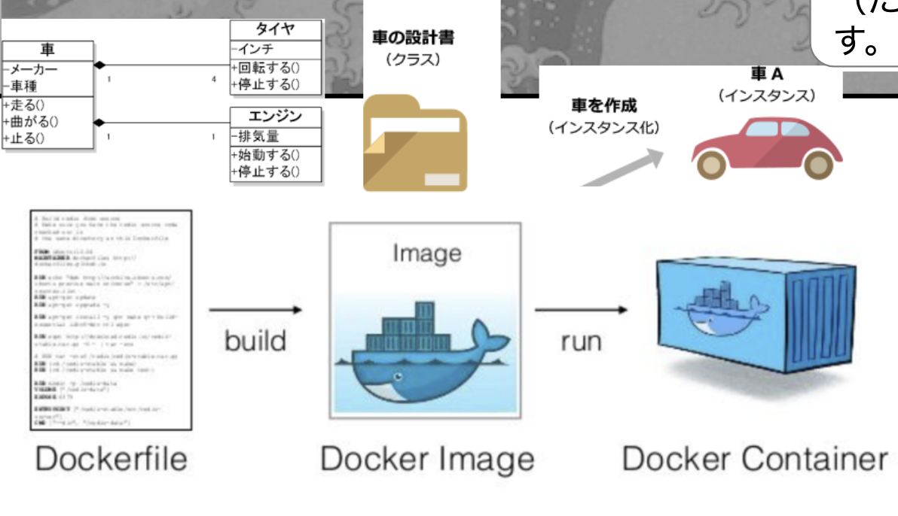
PodはK8s管理上の基本単位であり通常１〜2つのコンテナが存在しています。Pod内では仮想NICを共有し（同じIP、同じVolumeファイルシステム）、同一Nodeに配置されます。Pod は Kubernetes 上でホストに相当する単位です。

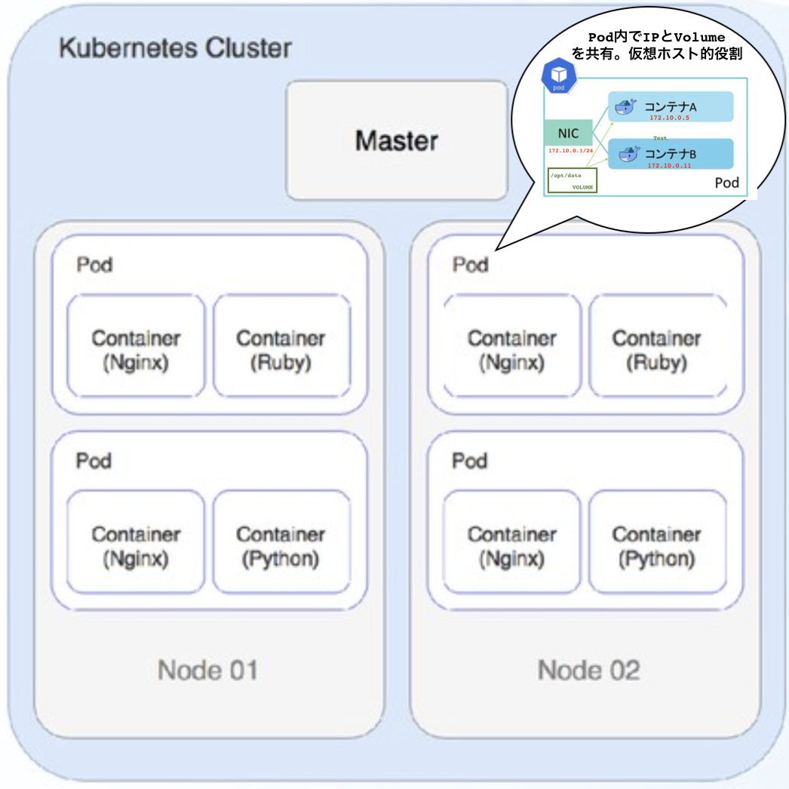


## 7. K8s Master-Node Architecture (kubectl client vs API server)

プログラマーだとインフラ設計経験がない人もいると思うのでクライアント・サーバーと言われても「何それ？」ってなるかもしれません

__クライアント・サーバーアーチテクチャの例え__:
- 簡単な例えだと、カスタマーサポートチャットがいい例だと思います


ドッカーも似たように、入力画面とコマンドラインがクライアント、実際にコンテナを装備するのがサーバーです

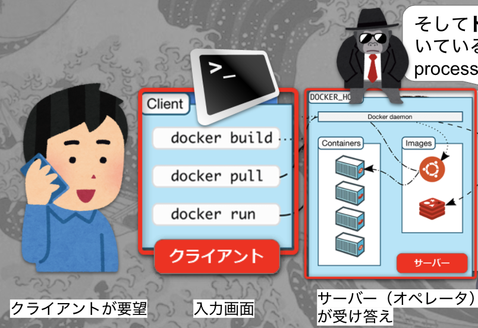

K8sも似たように、入力画面とコマンドラインがクライアント、実際にコンテナを装備するのがサーバー（マスターノードに存在するAPIサーバー）です

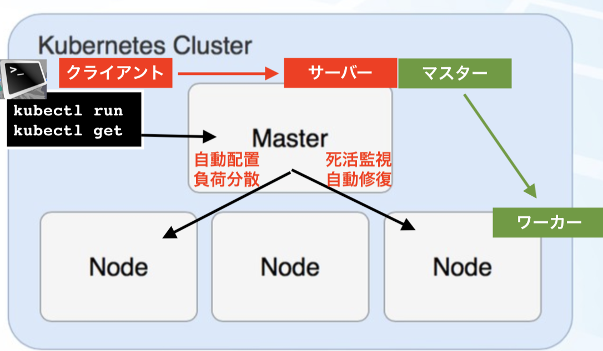

- マスター・コンポーネント (server to kubectl)
    - クラスタの制御を待ち受けるもの
    - クラスタ全体に関わる決定を行う
    - スケジューリングやイベントの検知や対応
- ノード・コンポーネント (slave to master)
    - コンテナが実行されるサーバー
    - 複数ノードでクラスター形成
    - 実行中のポッドを維持し、Kubernetesランタイム環境を提供


- kubectl client

マニフェストを作成し、マスターコンポーネントに操作をさせる
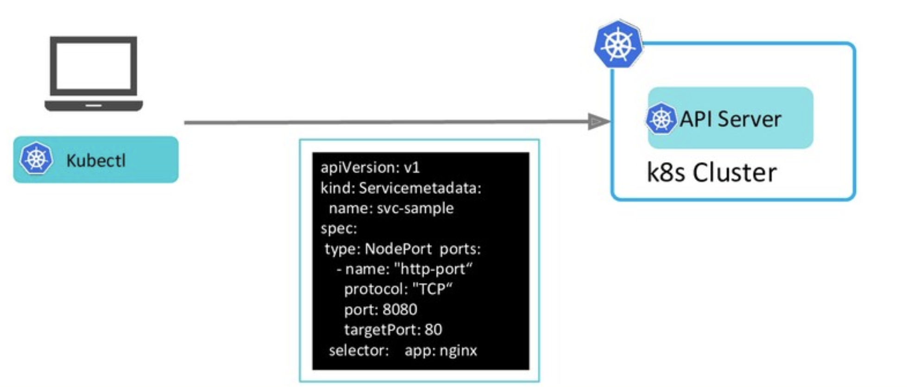


## 8.Install K8s (in 2020)
学習用環境 Minikube では、マスター・コンポーネントとノード・コンポーネントを、一つのサーバーの中で実行してコンパクトな環境を作ります。

- まずはMInikubeとkubectlをインストール
```
＃BrewコマンドはMacのみ
brew install minikube　

brew install kubectl
```
- Minikubeを起動
```
minikube start
minikube status
```
- クラスタのバージョン確認
```
kubectl version
```
- クラスタの正常性確認
```
kubectl cluster-info
kubectl get componentstatus
```
- クラスタのノード一覧表示
```
kubectl get nodes
```
- クラスタのノード詳細情報表示
```
kubectl describe nodes
```

[Web based K8s Playground](https://labs.play-with-k8s.com/)


## 9. Useful Tools

- “Watch” command
```
watch -t 'kubectl get pod'
```
- “Bat” command
```
brew instal bat
bat pod.yaml
```

## 10. Browser-based Docker playground

[Docker Playground](https://labs.play-with-docker.com/)
[Katacoda](https://www.katacoda.com/courses/docker/playground)

---
NEXT > [2. Intro to Basic Linux Commands and Concepts](../2_Linux_Basics/README.md) 