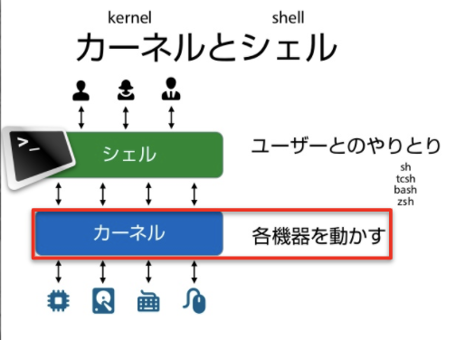
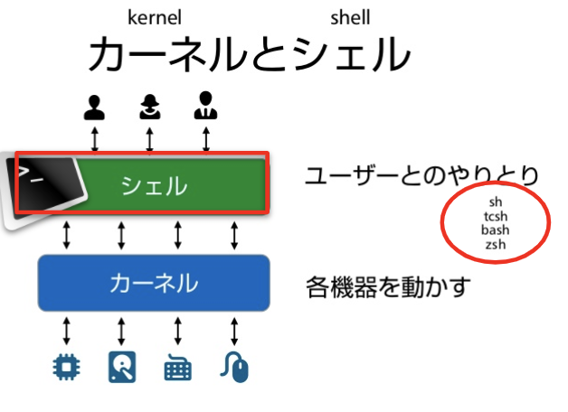
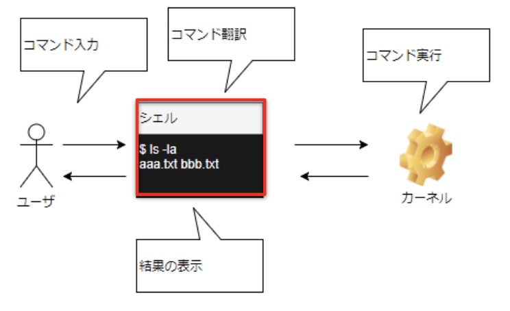
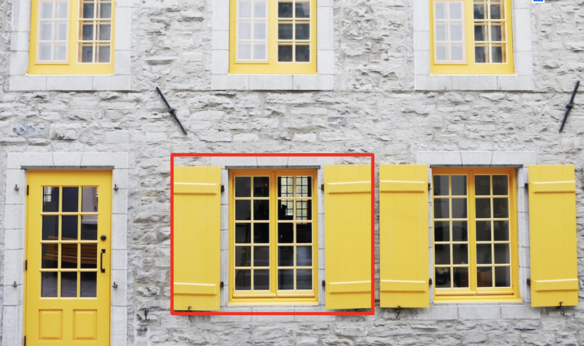
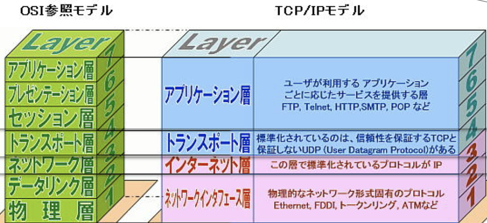
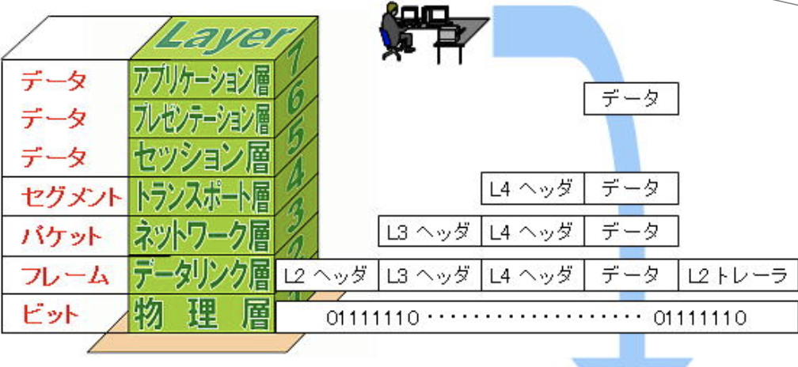
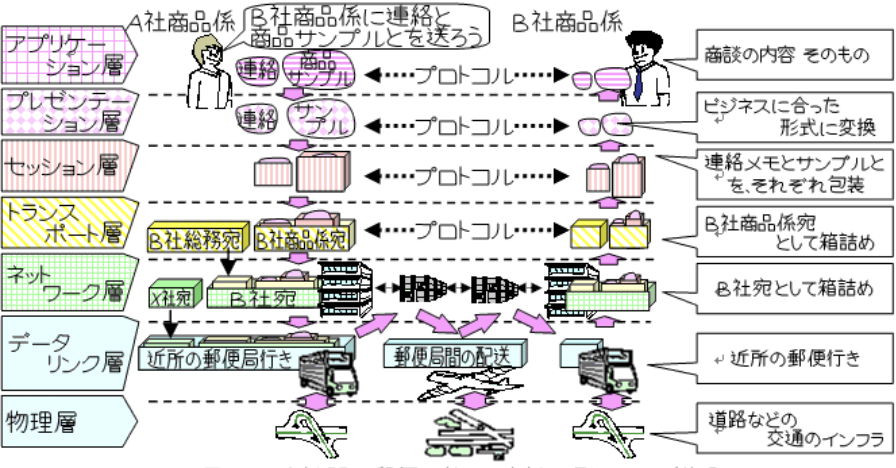

# 2. 猿でも分かるLinuxの基本操作 (Linux Basics)

インフラとかLinuxも全然わからん・・・

安心してください。実は自分も元はデベロパーで、
大学でCS専攻だったのにLinuxのコマンドとか全然
深く学びませんでした。Linuxはとっつきにくかったですね。

## 1. Linuxのカーネルとは何？ (Linux Kernel)

__簡単に言うと、カーネルとはハードウェア民族と通訳ができる人（唯一のソフトウェア）のことです__

## 2. Linuxのシェルとは何？ (Termnial vs Shell vs Bash)

__簡単に言うと、シェルとはカーネルに直で繋がってるチャットインターフェース的なものです。もちろんシェルは言語でもあります__

シェルは人間とカーネルの間の伝達マンなので、インプットとアウトプットも表示できます

## 3. シェルのSTDINとSTDOUTとは？ (STDIN, STDOUT, STDERR)

- ターミナルで見えるシェルはフォアグランドプロセスで、インプット(STDIN)とアウトプット(STDOUT&STDERR)が見えます
- これがバックグラウンドのプロセスだと、例えで言うと窓の扉がしまった状態で、アウトプットも見えないし、インプットも聞いてくれません

__Foreground vs Backgroundプロセスの例え__:

__TTY=Tele Typewriter__

- この黄色い扉を開ける(中の住人と会話できる)ことはシェルのSTDINとSDTOUTをターミナルに繋げること（ターミナルというGUIにTTYをアタッチしてForegroundプロセスに持ってくることで、インプットとアウトプットがターミナルで見える）
- このTTYをターミナルにアタッチすることは(プロセスとターミナルから会話できる)、ドッカーの中にシェルで入るときに”docker exec --interactive --tty”で使うので覚えておいてください

## 4. シェル基本コマンド (Linux Basic Commands)

シェルでは、WindowsやMacの<strong>フォルダー</strong>のドラッグドロップ見たいのをコマンドだけでできます:
- `ls`
- `mkdir test_dir`
- `cd test_dir`
- `pwd`

シェルでは、WindowsやMacの右クリックで出てくる「新しい<strong>ファイル</strong>・削除」がコマンドでできます:
- `touch text.txt`
- `echo "Hello World" >> test.txt`
- `cat text.txt`
- `rm text.txt`

シェルでは、タスクマネージャーのようにプロセスを表示できます。またバックグラウンドで起動もできます
- `ps`
- `sleep 50 &`
- `fg`

シェルコマンドの使い方を知りたい場合や、コマンドがインストールされてる場所を表示したりします：
- `ps --help`
- `which ps`
- `man ps`

Linuxにはサーチバーがないので、ファイルやフォルダーをサーチする場合に使うコマンドを使います：
- `find / -type d -name grep`
- `grep "Hello" test.text -n`
- `find / -type d -name nginx | xargs grep -r html`

## 5. Computer Networking

ネットワーキングは、プロトコルとかTCP・IPとかIPアドレスとかMACアドレスやHTTPS、DNSと関係してきます

ただ結構奥が深いので、なんとなく７階建てのネットワーキングビルがあると思ってください

そして７階から郵便を配送する場合、１階に降りるまで７層カプセル化していくみたいな感じです(例：ロシアマトリョーシカ）

また国際郵便を送る時のアドレス表記のレイヤーを考えるとわかりやすいです。(国コード、県、市町村、建物、部署、宛名)

---
NEXT > [3_Docker_Basics__Hello_World_Demo](../3_Docker_Basics__Hello_World_Demo/README.md)