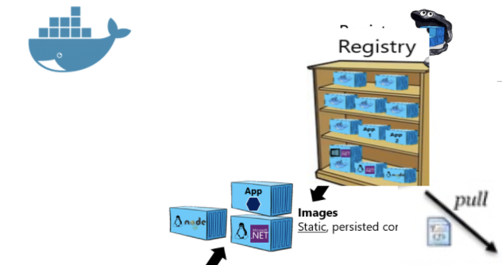

# 3. サクッとドッカー基本コマンドおさらい

## 3.1 Nginxドッカーイメージを取得 (Get Docker Image)
- ドッカーイメージを取得 (Pull)
```
docker pull nginx
```
- ドッカーイメージを表示 (List)
```
docker images
```
- ドッカーイメージの履歴を表示 (History)
```
docker history nginx
```
- ドッカーイメージを削除 (Delete Docker Image)
```
docker rmi nginx

docker images
```



## 3.2 nginxサーバーのコンテナを起動 (Start Docker Container from Image)

それではドッカーを使って、Hello Worldをサーバーから表示させてみましょう


- nginxサーバーのコンテナを起動 (Run)
```
$ docker run -p 80:80 --name nginx nginx
```
- 作動中のコンテナ一覧を表示 (List)
```
docker ps

# 停止中のコンテナも全て一覧表示
docker ps --all
```
- コンテナのログを表示 (Log)
```
docker logs nginx
```
- コンテナのメタデータを見てみる (Inspect Docker container)
```
docker inspect nginx
```
- Stop
```
docker stop nginx
```
- 停まったコンテナを削除 (Remove)
```
docker rm nginx
```
- コンテナをバックグラウンドで起動 `--detach`
 (Start container in background)
```
docker run --detach -p 80:80 --name nginx nginx
```
- 作動中のコンテナの中にシェルで入る (Exec) `exec -it`
```
docker exec -it nginx sh

exit
docker stop nginx
```
- コンテナの環境変数を設定する `--env TEST_ENV=hellow_world`
```
docker run --env TEST_ENV=hellow_world -d --name nginx nginx

docker exec -it nginx env
docker stop nginx
```
- コンテナに繋げるホスト側のポートを変える `-p 8080:80`
```
docker run -p 8080:80 -d --name nginx nginx

curl localhost:8080
```


## 3.3 ドッカーイメージ作成 (Build Docker image)

- Dockerfileからイメージ作成 (build)
```
docker build --tag dockerfile_hello .

# 自作イメージからコンテナを起動
$ docker run -d -p 9090:80 --name hello_v2 dockerfile_hello

curl localhost:9090
```
- ドッカーイメージの履歴を表示 (History)
```
docker history dockerfile_hello
```


## コンテナ・イメージのクリーンアップ

- 停止中のコンテナと無名のイメージを削除
```
docker system prune
```
- 起動中のコンテナ含め全コンテナを削除(注意)
```
docker rm -vf $(docker ps -a -q)
```
- 全てのイメージを削除(注意)
```
docker rmi -f $(docker images -a -q)
```

---
NEXT > [4_Multi_Containers_with_docker_compose](../4_Multi_Containers_with_docker_compose/README.md)