# 4. Hello Worldã§Kubernetesã®ä¸€é€£ä½œæ¥­ãƒ•ãƒ­ãƒ¼ã‚’ç†è§£ã—よã†

## 4.1 K8s Master-Node アーキテクãƒãƒ£ã¨ã¯ï¼Ÿ (kubectl client vs API server)


## 4.2 K8s Kubectlã¨ã¯ï¼Ÿ
クラスターã®Master API Serverエンドãƒã‚¤ãƒ³ãƒˆã‚’表示
```
kubectl cluster-info
```

クラスターNodeを表示
```
kubectl get nodes
```

クラスターエンドãƒã‚¤ãƒ³ãƒˆã¨CA certã€ãã—ã¦ãƒ¦ãƒ¼ã‚¶ãƒ¼ã®TLS keyを表示
```
kubectl config view
```

アウトプット
```
apiVersion: v1
kind: Config
clusters:
- cluster:
    certificate-authority: /Users/USERNAME/.minikube/ca.crt
    server: https://192.168.64.4:8443
  name: minikube
contexts:
- context:
    cluster: minikube
    user: minikube
  name: minikube
current-context: minikube
users:
- name: minikube
  user:
    client-key: /Users/USERNAME/.minikube/profiles/minikube/client.key
```

## 4.3 POD: helloworldコンテナをk8s Podã§èµ·å‹•ã€Dockerコãƒãƒ³ãƒ‰ã¨ã®æ¯”較 (Start k8s pod)
### Pod definition & diagram
- Podã¯ã‚³ãƒ³ãƒ†ãƒŠã‚’グループ化ã—ã¦ã€IPã¨Volumeを共有ã™ã‚‹ä»®æƒ³ãƒ›ã‚¹ãƒˆã®ã‚ˆã†ãªåƒã
- Podã¯Matrixã®ãƒã‚ªãŒç”Ÿã¾ã‚Œã¦ãる時ã®ãƒãƒƒãƒ‰
- ref: https://ubiteku.oinker.me/2017/02/21/docker-and-kubernetes-intro/
- Pod – 管ç†ä¸Šã®åŸºæœ¬å˜ä½ã€ä»®æƒ³NICを共有（åŒã˜IPã€åŒã˜Volumeファイルシステム）ã€åŒä¸€Nodeã«é…ç½®ã•ã‚Œã‚‹. Pod 㯠Kubernetes 上ã§ãƒ›ã‚¹ãƒˆã«ç›¸å½“ã™ã‚‹å˜ä½ã§ã™


ãã‚Œã§ã¯Podを使ã£ã¦ã€Hello Worldã‚’k8sã«Deployã—よã†

- ã‚‚ã†1ã¤ã®ã‚·ã‚§ãƒ«ã§Podã¨Serviceã‚’Watch
```
watch 'kubectl get pod,svc -o wide'
```
- Hello Worldã®Podã‚’èµ·å‹•
```
# docker run -p 800:8080 --name helloworld gcr.io/google-samples/hello-app:1.0

kubectl run --image gcr.io/google-samples/hello-app:1.0 --restart Never helloworld
```
- Podを表示 (List)
```
# docker ps

kubectl get pods
```
- Pod内ã®ãƒ­ã‚°ã‚’表示 (Log)
```
# docker logs helloworld

kubectl logs helloworld
```
- Podã®ãƒ¡ã‚¿ãƒ‡ãƒ¼ã‚¿ã‚’見ã¦ã¿ã‚‹ 
```
# docker inspect helloworld

kubectl describe pod helloworld
```
- 作動中ã®ã‚³ãƒ³ãƒ†ãƒŠã®ä¸­ã«ã‚·ã‚§ãƒ«ã§å…¥ã‚‹ (Exec) `exec -it`
```
# docker exec -it helloworld sh

kubectl exec -it helloworld sh
```
- Podを削除
```
# docker rm helloworld

kubectl delete pod helloworld
```
- コンテナã®ç’°å¢ƒå¤‰æ•°ã‚’設定ã™ã‚‹ `--env TEST_ENV=hellow_world`
```
# docker run --env TEST_ENV=hellow_world -d --name helloworld helloworld

kubectl run --env TEST_ENV=hellow_world --image gcr.io/google-samples/hello-app:1.0 --restart Never helloworld

kubectl exec -it helloworld env
kubectl delete pod helloworld
```
- コンテナã«ç¹‹ã’るホストå´ã®ãƒãƒ¼ãƒˆã‚’変ãˆã‚‹ `-p 8080:8080`
```
# docker run -p 8080:8080 -d --name helloworld helloworld

kubectl run --port 8080 --image gcr.io/google-samples/hello-app:1.0 --restart Never helloworld
```

- クラスター内ã®ä»–ã®Podã‹ã‚‰ã€HelloWorld Podã¸ã®ã‚¢ã‚¯ã‚»ã‚¹ã‚’テスト
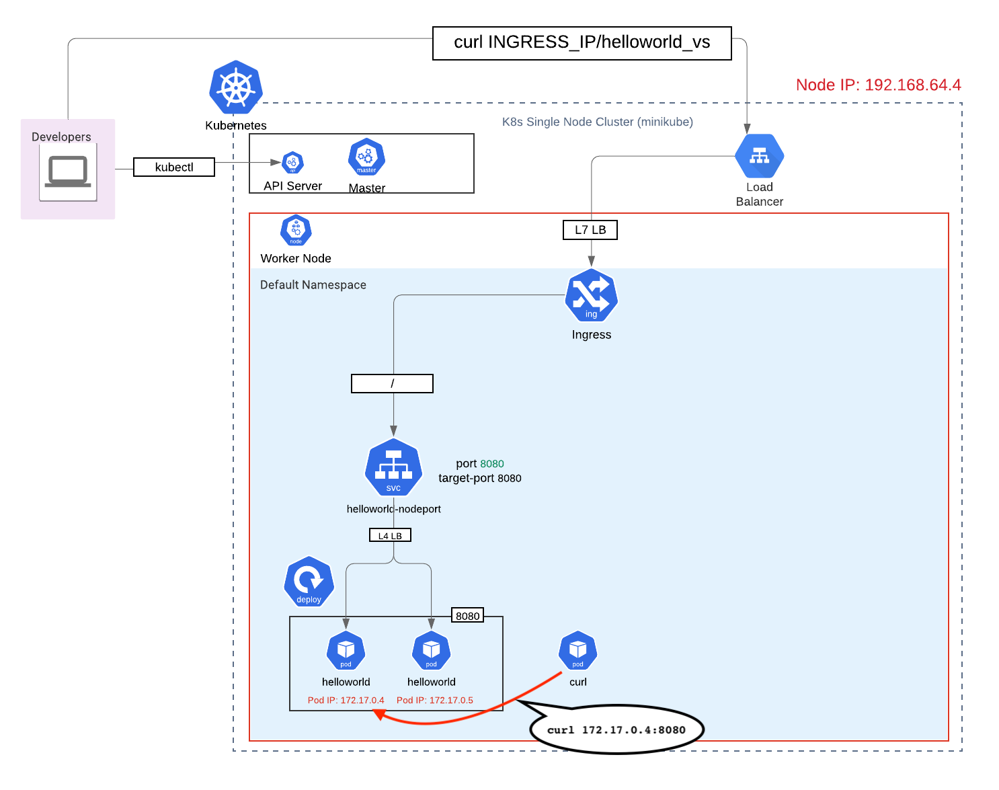

```
kubectl run --restart Never --image curlimages/curl:7.68.0 -it --rm curl sh

# curl helloworld pod
curl 172.17.0.4:8080

Hello, world!
Version: 1.0.0
Hostname: helloworld
```

- Pod IPã‚’å–å¾—ã—ã€ãƒ›ã‚¹ãƒˆOSã‹ã‚‰<strong>Curlã™ã‚‹ãŒæ¥ç¶šã§ããªã„</strong>
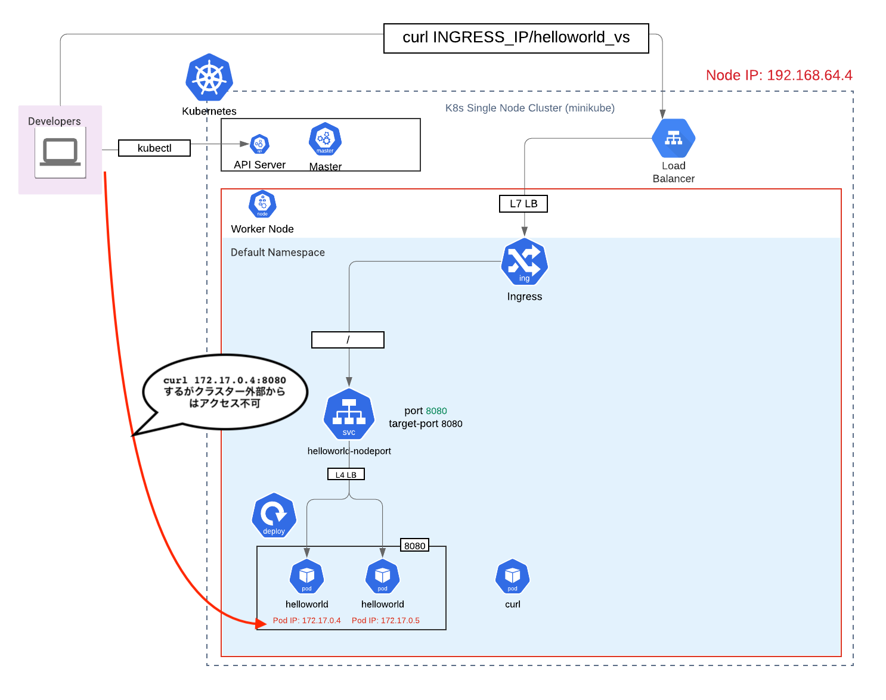
```
kubectl get pods -o=jsonpath='{.items[0].status.podIP}'

curl $(kubectl get pods -o=jsonpath='{.items[0].status.podIP}'):8080
```

## ãªãœï¼Ÿï¼Ÿ
Minikubeã¨ã„ã†Single Node K8sクラスターã¯ã€MacOSã®å ´åˆã¯VirtualBoxã¨ã„ã†VMã®ä¸­ã«ä½œã‚‰ã‚Œã¦ã„ã¾ã™ã€‚ãªã®ã§ã€MacOSã®ãƒ›ã‚¹ãƒˆãƒãƒƒãƒˆãƒ¯ãƒ¼ã‚¯ã¯ã€VM内ã«ã‚ã‚‹K8sクラスターã®ãƒãƒƒãƒˆãƒ¯ãƒ¼ã‚¯ã¨ã¯é•ã†ã®ã§ï¼ˆå¤–部扱ã„）ã€Podã®IPã«ã‚¢ã‚¯ã‚»ã‚¹ãŒã§ããªã„ã®ã§ã™ã€‚

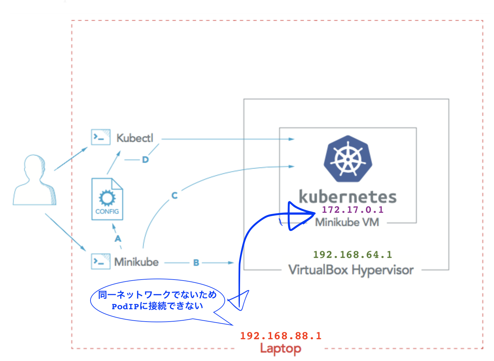

- ホストã®IPã¨VMã®ãƒãƒƒãƒˆãƒ¯ãƒ¼ã‚¯ã‚¤ãƒ³ã‚¿ãƒ¼ãƒ•ã‚§ã‚¤ã‚¹ã®IPを確èª
```
ifconfig
```

Outputを見るã¨ãƒ›ã‚¹ãƒˆã®`192.168.88.15`ã¨VMã®`192.168.64.1`ã§ã€åŒã˜CIDRレンジã ãŒã€VM内ã«ã‚ã‚‹ã‚‚ã†1ã¤ã®K8sã®ãƒãƒƒãƒˆãƒ¯ãƒ¼ã‚¯ã®IPレンジã¯`172.17.0.1`ãªã®ã§ï¼ˆåˆ¥ã®ãƒãƒƒãƒˆãƒ¯ãƒ¼ã‚¯ï¼‰æ¥ç¶šã¯ã§ããªã„。
```
# ホスト
en0: flags=8863<UP,BROADCAST,SMART,RUNNING,SIMPLEX,MULTICAST> mtu 1500
        ether 78:4f:43:5e:0d:37 
        inet6 fe80::cfa:77a0:efe7:70c7%en0 prefixlen 64 secured scopeid 0x8 
        inet 192.168.88.15 

＃VMã®NIC
bridge100: flags=8863<UP,BROADCAST,SMART,RUNNING,SIMPLEX,MULTICAST> mtu 1500
        options=3<RXCSUM,TXCSUM>
        ether 7a:4f:43:e5:e7:64 
        inet 192.168.64.1 netmask 0xffffff00 broadcast 192.168.64.255
```

ã¤ã¾ã‚Šã€PodãŒå¤–部ãƒãƒƒãƒˆãƒ¯ãƒ¼ã‚¯ã‹ã‚‰ã‚¢ã‚¯ã‚»ã‚¹ã§ãるよã†ã«ã™ã‚‹ã«ã¯ã€Serviceを作ã£ã¦å…¬é–‹ã™ã‚‹å¿…è¦ãŒã‚ã‚Šã¾ã™ã€‚


---
## 4.4 SERVICE: コンテナをService（L4 LB）ã§ã‚¯ãƒ©ã‚¹ã‚¿å†…部・外部ã‹ã‚‰ã‚¢ã‚¯ã‚»ã‚¹å¯èƒ½ã«ã™ã‚‹ (Expose pod internally/externally using service)

### Service definition & diagram
- Serviceã¯Podをクラスター内外ã«å…¬é–‹ã™ã‚‹L4ロードãƒãƒ©ãƒ³ã‚µãƒ¼
- クラスター内外ã‹ã‚‰Podã¸ã®å®‰å®šçš„ãªã‚¢ã‚¯ã‚»ã‚¹ã‚’æä¾›ã§ãる仮想ã®IP アドレスを割り当ã¦ã¾ã™
- ref: https://ubiteku.oinker.me/2017/02/21/docker-and-kubernetes-intro/
- serviceã¯ã‚¯ãƒ©ã‚¹ã‚¿ãƒ¼ã®ãƒ¡ãƒ¢ãƒªå†…ã«å­˜åœ¨ã™ã‚‹


3ã¤ã®Service Type
- ClusterIP (クラスター内)
- NodePort (クラスター内外)
- LoadBalancer (クラスター内外)
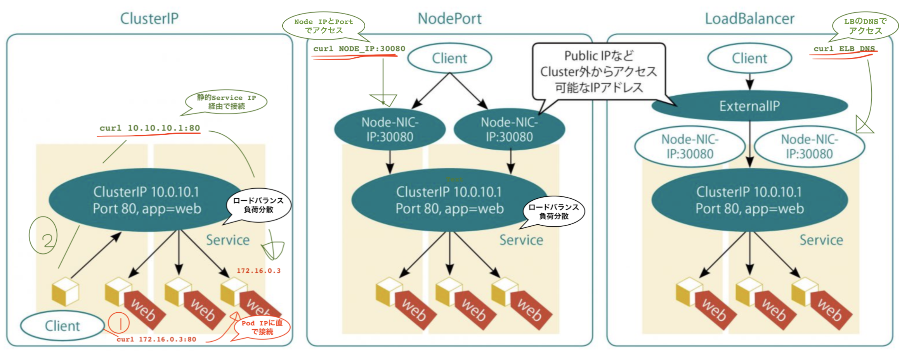

---
## 4.4.1 ClusterIP Service

実際ã«PodãŒã©ã®ãƒãƒ¼ãƒ‰ã«é…å‚™ã•ã‚Œã¦ã„ã‚‹ã‹ã¯åˆ†ã‹ã‚Šã¾ã›ã‚“。仮ã«åˆ†ã‹ã£ãŸã¨ã—ã¦ã‚‚ã€Pod ã¯é »ç¹ã«ä½œã‚Šç›´ã•ã‚Œã‚‹ã®ã§ã€ã„ã¤ã¾ã§ã‚‚åŒã˜Podã«ã‚¢ã‚¯ã‚»ã‚¹ã§ãã‚‹ä¿è¨¼ã¯ã‚ã‚Šã¾ã›ã‚“.

`ClusterIP`ã®Serviceを使ã†åˆ©ç‚¹ã¯ã€ã„ã¤æ¶ˆãˆã‚‹ã‹ã‚ã‹ã‚‰ãªã„PodIPを抽象化ã—ã€StaticIPã‚’æŒã£ãŸProxyã‚’å‰ã«ç½®ãã“ã¨ã§ï¼š
1. Podã«ã‚¢ã‚¯ã‚»ã‚¹ã™ã‚‹éš›ã«ã€Pod IPを知る必è¦ãŒãªããªã‚‹ 
2. Podã«ã‚¢ã‚¯ã‚»ã‚¹ã™ã‚‹éš›ã«ã€ãƒ­ãƒ¼ãƒ‰ãƒãƒ©ãƒ³ã‚¹ã—ã¦ãれる

ã“ã¨ã§ã™ã€‚


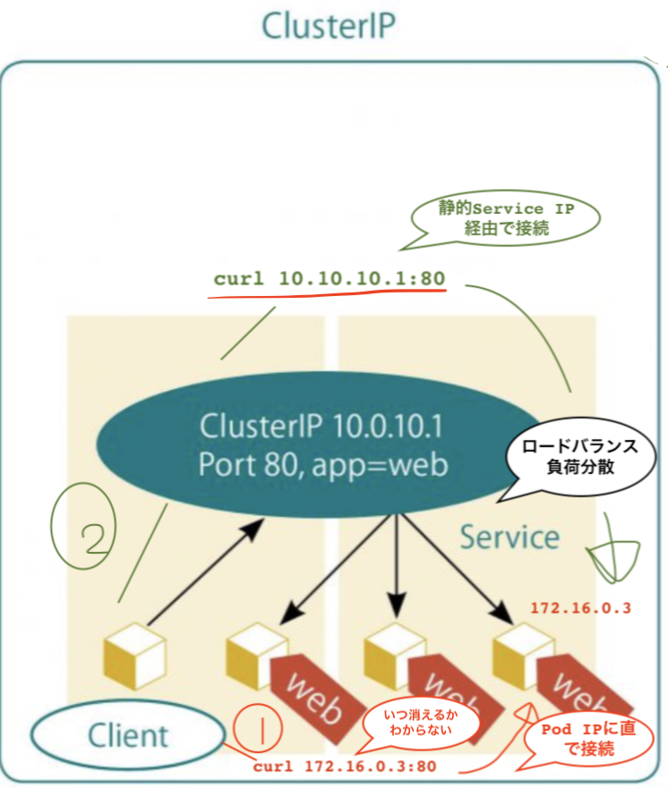

- Podã‚’Serviceã®ClusterIPタイプã§ã‚¯ãƒ©ã‚¹ã‚¿ãƒ¼å†…ã«å…¬é–‹ä¸”ã¤ãƒ­ãƒ¼ãƒ‰ãƒãƒ©ãƒ³ã‚¹
```
kubectl expose pod helloworld --type ClusterIP --port 8080 --name helloworld-clusterip

kubectl get service
service/helloworld-clusterip   ClusterIP   10.98.144.224   <none>
 8080/TCP   7s     run=helloworld
```

- クラスター内ã®ä»–ã®Podã‹ã‚‰ã€helloworld `ClusterIP` serviceアクセスをテスト
```
kubectl run --restart Never --image curlimages/curl:7.68.0 -it --rm curl sh

# curl helloworld ClusterIP service
curl helloworld-clusterip:8080

Hello, world!
Version: 1.0.0
Hostname: helloworld
```

- ã‚‚ã¡ã‚んクラスター外ã®Macã‹ã‚‰Curlã—ã¦ã‚‚æ¥ç¶šã§ããªã„
```
curl 10.98.144.224:8080
curl: (7) Failed to connect to 10.98.144.224 port 8080: Operation timed out
```


---
## 4.4.2 NodePort Service

`NodePort`ã®Serviceを使ã†åˆ©ç‚¹ã¯ã€`ClusterIP`ã§ã¯ä¸å¯èƒ½ã ã£ãŸã€ã‚¯ãƒ©ã‚¹ã‚¿ãƒ¼å¤–ã¸ã®Podã®å…¬é–‹ã‚’NodeIPã¨NodePort経由ã§å¯èƒ½ã«ã™ã‚‹ã“ã¨ã§ã™ã€‚

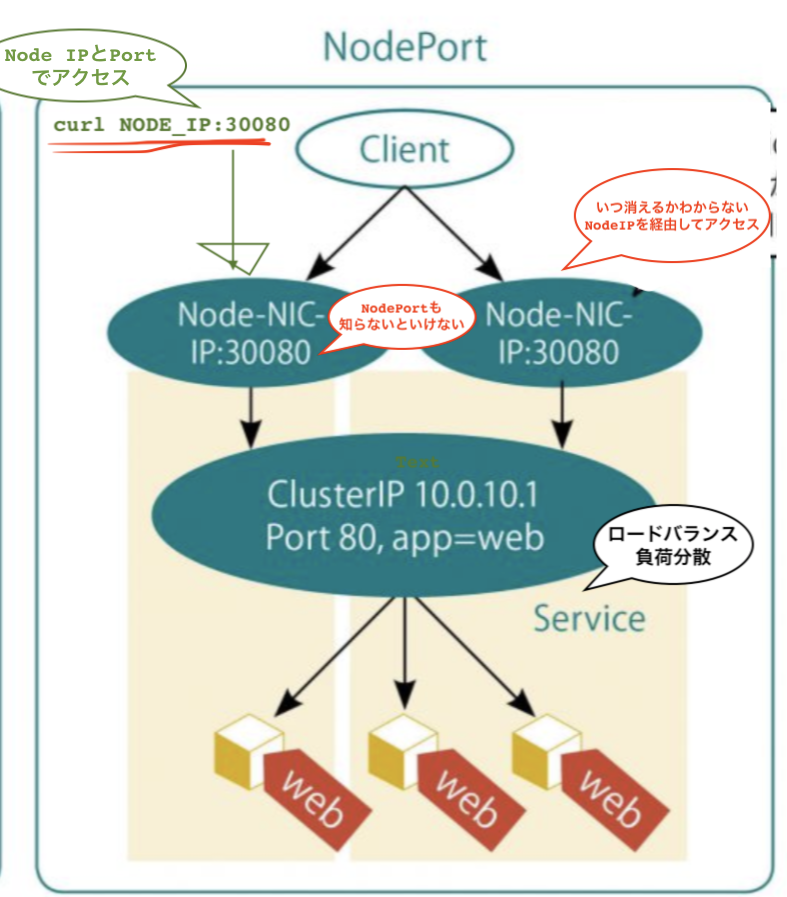

- Podã‚’Serviceã®NodePortタイプã§ã‚¯ãƒ©ã‚¹ã‚¿ãƒ¼å¤–ã«å…¬é–‹
```
kubectl expose pod helloworld --type NodePort --port 8080 --name helloworld-nodeport

kubectl get service
service/helloworld-nodeport    NodePort    10.101.144.42   <none>
 80:31954/TCP   76s   run=helloworld
```
- クラスター内ã®ä»–ã®Podã‹ã‚‰ã€helloworld `NodePort` serviceアクセスをテスト


```sh
# curl helloworld NodePort service
curl helloworld-nodeport:8080

Hello, world!
Version: 1.0.0
Hostname: helloworld
```

- クラスター外ã®Macã‹ã‚‰ã€NodeIPã¨NodePortを指定ã—ã¦Curlã™ã‚‹ã¨æ¥ç¶šã§ãã‚‹
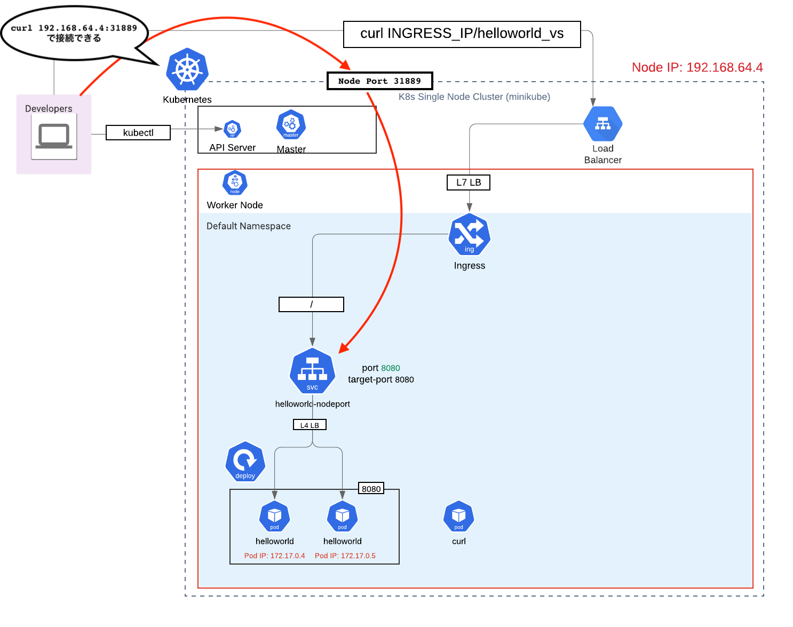
```sh
# Node IPã‚’å–å¾—ã™ã‚‹
minikube ip
curl 192.168.64.4:31889/

# or

curl $(minikube ip):31889

# or
minikube service helloworld-nodeport --url
```

## ã—ã‹ã—NodePortã«å•é¡ŒãŒï¼

`NodePort`ã®Serviceã§ã‚¯ãƒ©ã‚¹ã‚¿ãƒ¼å¤–ã«Podを公開ã§ãã¾ã™ãŒã€å•é¡Œã¯
1. NodeIPを知らãªã„ã¨ã„ã‘ãªã„
2. Node Port(ã—ã‹ã‚‚NodePortã¯3000以上ã®æ•°å­—)を知らãªã„ã¨ã„ã‘ãªã„

ã“ã¨ã§ã™ã€‚

PodãŒèµ·å‹•ãƒ»åœæ­¢ã—ã¦IPãŒå…¥ã‚Œæ›¿ã‚るよã†ã«ã€Multi-hostクラスター上ã®Nodeも起動・åœæ­¢ã—ã¦IPãŒå…¥ã‚Œæ›¿ã‚ã‚‹ã®ã§ã€NodeIPã§Podã«ã‚¢ã‚¯ã‚»ã‚¹ã™ã‚‹ã®ã¯å®‰å®šçš„ã§ã¯ã‚ã‚Šã¾ã›ã‚“。

ã“ã®ç‚¹ã‚’ã€Podã®å ´åˆã¯Serviceã®`ClusterIP`ã¨ã„ã†Proxyã«Static IPã‚’ä¸ãˆã‚‹ã“ã¨ã§ã€PodIPを知る必è¦ãŒãªããªã‚Šã¾ã—ãŸã€‚

Nodeã‚‚ã€ãƒ­ãƒ¼ãƒ‰ãƒãƒ©ãƒ³ã‚µãƒ¼ã‚’Nodesã®å‰ã«èµ·ãStaticIPã¨DNSã‚’ä¸ãˆã‚‹ã“ã¨ã§ã€NodeIPを知る必è¦ãŒãªããªã‚Šã¾ã™ã€‚ãã®ãŸã‚ã«ã¯ã€Serviceã®`LoadBalancer`タイプを使ã„ã¾ã™ã€‚


---
## 4.4.3 LoadBalancer Service

クラウドプロãƒã‚¤ãƒ€ã®L4ロードãƒãƒ©ãƒ³ã‚µãƒ¼ã®DNSã‹ã‚‰, å„ãƒãƒ¼ãƒ‰ã®ç‰¹å®šã®ãƒãƒ¼ãƒˆã«Routingã—ã¦Pod ã«ã‚¢ã‚¯ã‚»ã‚¹ã™ã‚‹ã€‚ 

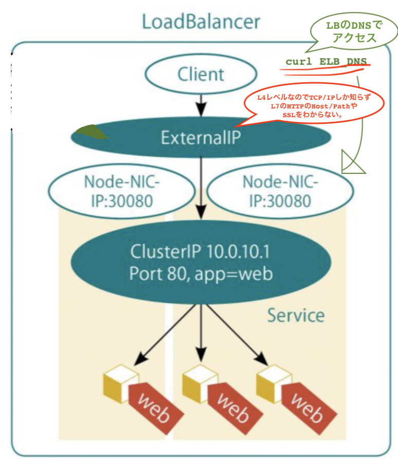

- Podã‚’Serviceã®`LoadBalancer`タイプã§ã‚¯ãƒ©ã‚¹ã‚¿ãƒ¼å¤–ã«å…¬é–‹
```
kubectl expose pod helloworld --type LoadBalancer --port 8080 --name helloworld-lb

service/helloworld-lb          LoadBalancer   10.104.89.126    <pending>
     8080:31838/TCP   5s     run=helloworld
```
- クラスター内ã®ä»–ã®Podã‹ã‚‰ã€helloworld `LoadBalancer` serviceアクセスをテスト
```
kubectl run --restart Never --image curlimages/curl:7.68.0 -it --rm curl sh

curl helloworld-lb:8080

Hello, world!
Version: 1.0.0
Hostname: helloworld
```
- クラスター外ã®Macã‹ã‚‰ã€NodeIPã¨NodePortを指定ã—ã¦Curlã™ã‚‹ã¨æ¥ç¶šã§ãã‚‹
```
minikube service helloworld-lb --url

curl $(minikube service helloworld-lb --url)
```

K8sクラスターをクラウドã§é‹å–¶ã™ã‚‹å ´åˆã¯ã€ã“ã®`LoadBalancer`ã®Serviceã¯ã€LBã®PublicIPã¨DNSãŒä¸ãˆã‚‰ã‚Œã¾ã™ã€‚


## ã—ã‹ã—LoadBalancerã«å•é¡ŒãŒï¼

`LoadBalancer`ã®Serviceã§ã‚¯ãƒ©ã‚¹ã‚¿ãƒ¼å¤–ã«Podを公開ã—ã€ä¸”ã¤LBã®PublicDNSを使ã£ã¦NodeIPを抽象化ã—ã¾ã—ãŸãŒã€LoadBalancerã®å•é¡Œã¯
1. 1ã¤ã®Serviceã”ã¨ã«1ã¤ã®LBãŒä½œã‚‰ã‚Œã¦ã—ã¾ã†ï¼ˆé«˜ã‚³ã‚¹ãƒˆï¼‰
2. L4ã®LBãªã®ã§TCI/IPã¾ã§ã—ã‹åˆ†ã‹ã£ã¦ãŠã‚‰ãšã€L7ã®HTTPã®ãƒ›ã‚¹ãƒˆãƒ»ãƒ‘スã§ã®LBã®æŒ¯ã‚Šåˆ†ã‘ãŒã§ããªã„

ã“ã¨ã§ã™ã€‚

ãªã®ã§ã€L7レベルã®HTTPホスト・パスã§LBã®æŒ¯ã‚Šåˆ†ã‘ã‚’ã™ã‚‹ãŸã‚ã«ã¯ã€`Ingress`を使ã„ã¾ã™ã€‚


---
## 4.5 INGRESS: helloworldコンテナをIngress（L7　LB）ã§ã‚¯ãƒ©ã‚¹ã‚¿å¤–部ã‹ã‚‰host/pathURLã§ã‚¢ã‚¯ã‚»ã‚¹å¯èƒ½ã«ã™ã‚‹ (Expose pod internally/externally using service)

### Ingress definition & diagram
- Ingressã¯Podをクラスター内外ã«å…¬é–‹ã™ã‚‹L７ロードãƒãƒ©ãƒ³ã‚µãƒ¼
- クラスター外部ã‹ã‚‰URLã®ãƒ›ã‚¹ãƒˆãƒ»ãƒ‘スã«ã‚ˆã‚‹Serviceã¸ã®æŒ¯ã‚Šåˆ†ã‘アクセスãŒã§ãã‚‹L7ロードãƒãƒ©ãƒ³ã‚·ãƒ³ã‚°ï¼ˆè² è·åˆ†æ•£ï¼‰
- ref: https://kubernetes.io/docs/tasks/access-application-cluster/ingress-minikube/


- Ingress addonを追加
```sh
# Addonをリスアップ
minikube addons list

# Ingress addonを追加
minikube addons enable ingress

# Ingress controller podã‚’ãƒã‚§ãƒƒã‚¯
kubectl get pods -n kube-system

# kubectl versionãŒ1.21以é™ã®å ´åˆã¯ã€-n ingress-nginxã‚’ãƒã‚§ãƒƒã‚¯
# kubectl get pods -n ingress-nginx
```

Ingressを作りã€å…¨ã¦ã®ãƒ‘ス`/`ã‚’`helloworld-nodeport` serviceã«æ¥ç¶šã—ã¾ã™ã€‚

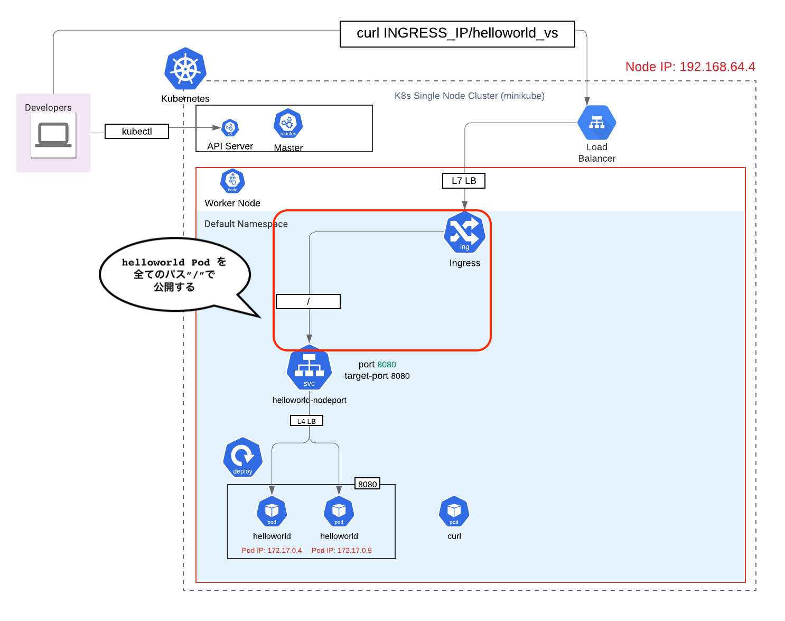

- ingress resourceを作æˆ
```
kubectl apply -f ingress.yaml
```
- ingressをリストアップ
```
kubectl get ingress
```
- ingress resourceã®è©³ç´°ã‚’表示
```
kubectl describe ingress helloworld
```
- ingress controller (ALB)ã®IPã‚’å–å¾—
```sh
kubectl get ingress | awk '{ print $4 }' | tail -1

# or

kubectl get ingress -o=jsonpath='{.items[0].status.loadBalancer.ingress[0].ip}'

# or
minikube service helloworld --url

# output
🃠 Starting tunnel for service vote.
|-----------|------|-------------|------------------------|
| NAMESPACE | NAME | TARGET PORT |          URL           |
|-----------|------|-------------|------------------------|
| default   | helloworld |             | http://127.0.0.1:62585 |
|-----------|------|-------------|------------------------|
http://127.0.0.1:62585
```
- Ingress経由ã§ã€helloworld-nodeport　Serviceã«ã‚¢ã‚¯ã‚»ã‚¹
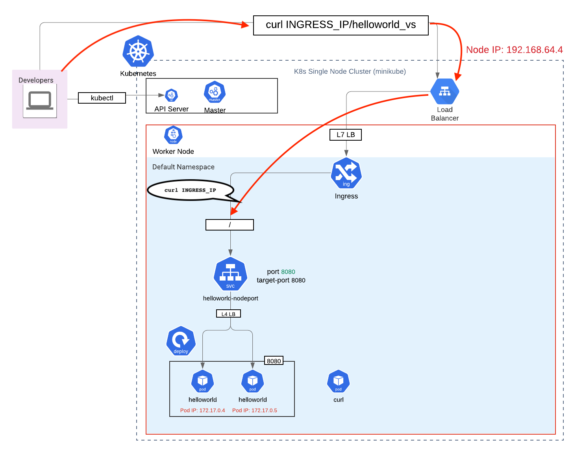

```
curl $(kubectl get ingress | awk '{ print $4 }' | tail -1)
```


### æ–°ã—ã„ Ingress リソース /helloworld_v2 ã®ä½œæˆ
- Hello World v2 Podを作æˆã—ã€Serviceã‚’NodePortã¨ã—ã¦å…¬é–‹, HTTPパス`/helloworld_v2`を使ã£ãŸingress resourceを作æˆ

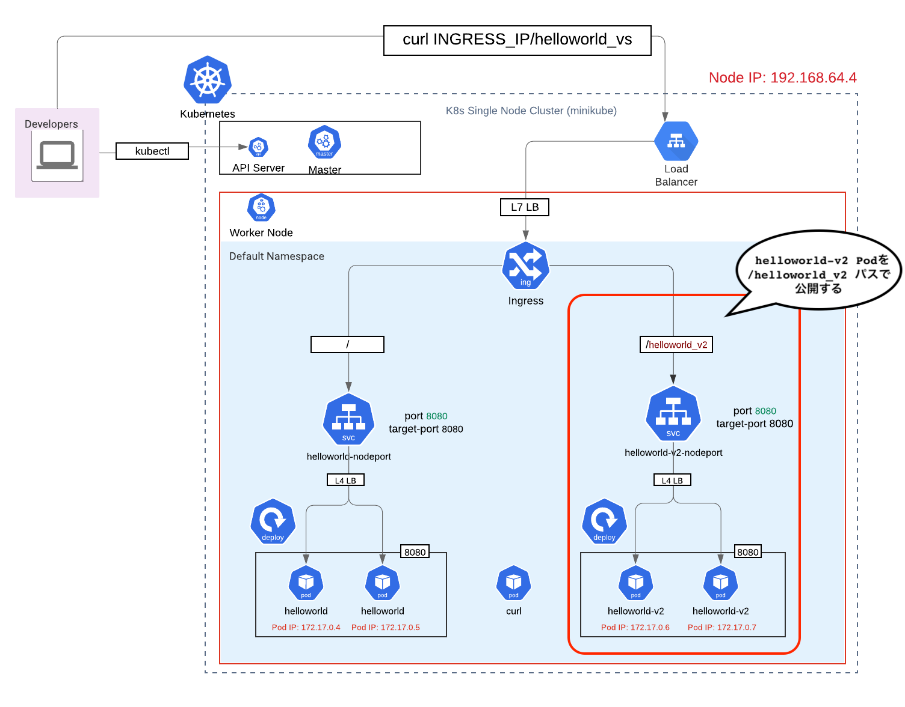

```sh
# pod
kubectl run --image gcr.io/google-samples/hello-app:2.0 --port 8080 --restart Never helloworld-v2

# service
kubectl expose pod helloworld-v2 --type NodePort --port 8080 --name helloworld-v2-nodeport

# ingress
kubectl apply -f ingress_path.yaml
```
- HTTPパスを使ã£ãŸingress resourceã®è©³ç´°ã‚’表示
```
kubectl describe ingress helloworld-v2
```

- クラスター内ã®ä»–ã®Podã‹ã‚‰ã€helloworld-v2 Podアクセスをテスト
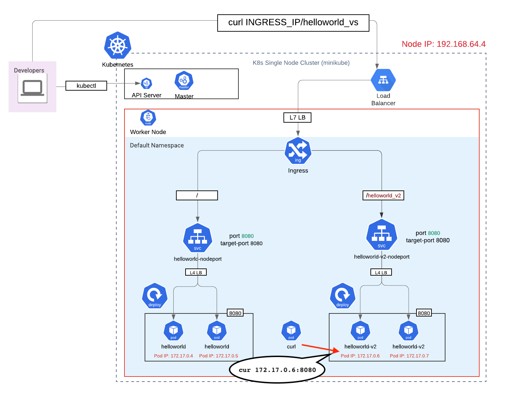
```sh
kubectl run --restart Never --image curlimages/curl:7.68.0 -it --rm curl sh

# curl helloworld-v2 pod
curl 172.17.0.6:8080

Hello, world!
Version: 2.0.0
Hostname: helloworld-v2
```


- クラスター内ã®ä»–ã®Podã‹ã‚‰ã€helloworld-v2-nodeport serviceアクセスをテスト 
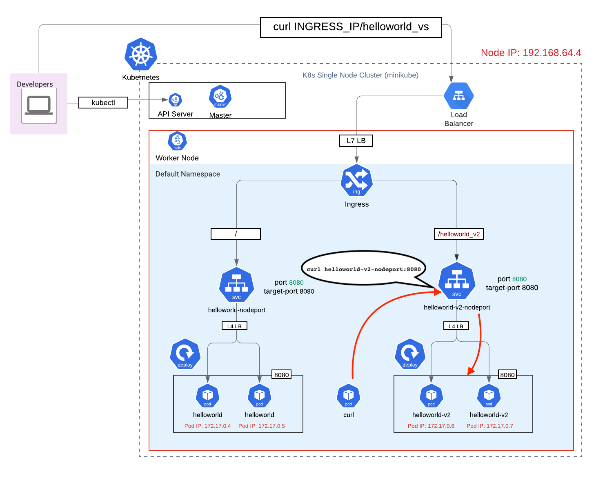
```
curl helloworld-v2-nodeport:8080

Hello, world!
Version: 2.0.0
Hostname: helloworld-v2
```


- Ingressã®`/helloworld_v2`パス経由ã§ã€helloworld-v2-nodeport　Service㫠アクセス
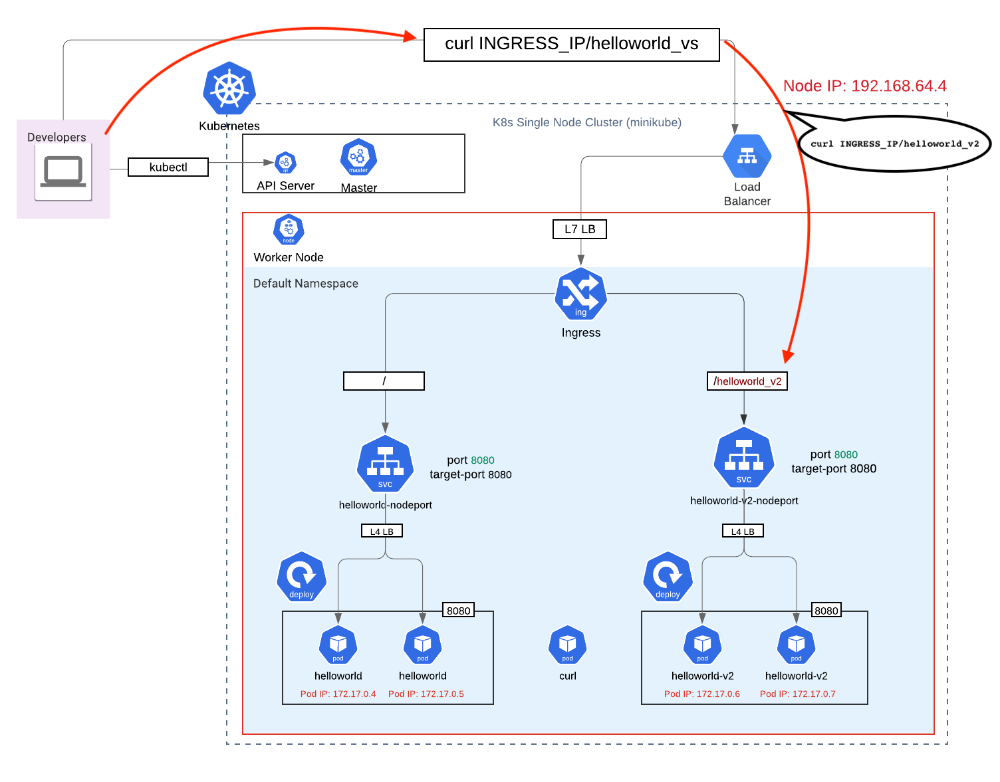

```
curl $(kubectl get ingress helloworld-v2 | awk '{ print $4 }' | tail -1)/helloworld_v2

Hello, world!
Version: 2.0.0
Hostname: helloworld-v2
```

### Cleanup
```
kubectl delete pod helloworld
kubectl delete pod helloworld-v2
```

---
## 4.6 REPLICA: helloworldコンテナをスケールアップ (scale up pods using deployment)

### Replicas definition & diagram
- Replicaã¯Podを複製ã™ã‚‹
- Self-healingã¯æ­»ã‚“ã§ã‚‚死んã§ã‚‚生ã¾ã‚Œå¤‰ã‚ã£ã¦å‡ºã¦ãるスミス
- Specã§å®šç¾©ã•ã‚ŒãŸãƒ¬ãƒ—リカã®æ•°ã‚’自動é…置・維æŒ(é…å‚™ã¨å†—長化)
- Podã®æ•°ã¯Dynamicã«å®šç¾©ã‚‚ã§ãã¾ã™ï¼ˆæ°´å¹³Auotoscaling）

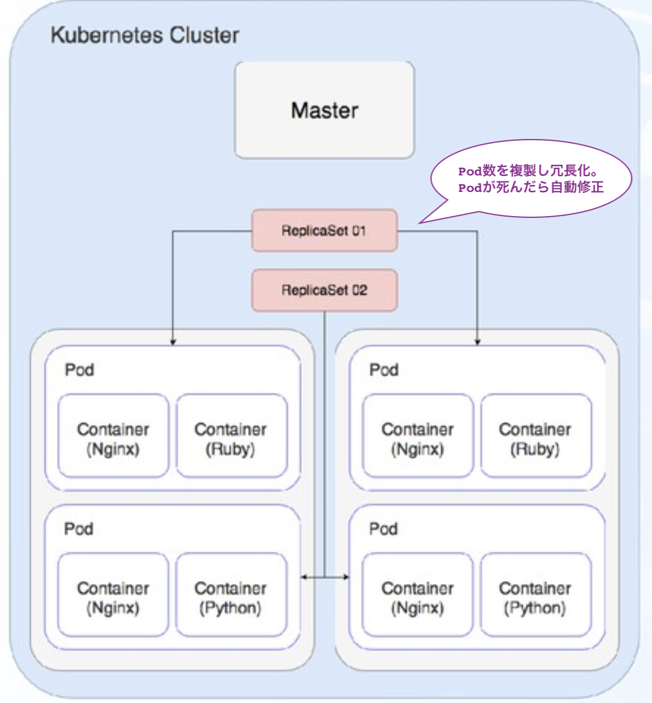

- scale --replicas=3
```sh
#ã¾ãšã¯Podã‚’Replicasetã¨ã—ã¦1ã¤èµ·å‹•
kubectl apply -f replicaset.yaml

# Replicasetをリストアップ
kubectl get replicaset

# 3ã¤ã«ã‚¹ã‚±ãƒ¼ãƒ«ã‚¢ãƒƒãƒ—
kubectl scale --replicas=5 replicaset/helloworld　
```

- 1ã¤ã®Podã‚’åœæ­¢ã—ã¦ã¿ã‚‹
```
kubectl delete pod POD_ID
```

- æ–°ã—ã„PodãŒè‡ªå‹•ç”Ÿæˆã•ã‚ŒãŸã®ãŒã‚ã‹ã‚‹
```sh
kubectl get pods

# cleanup
kubectl delete -f replicaset.yaml
```

---
## 4.7 DEPLOYMENT: helloworldコンテナをローリングアップデートã€ãƒ­ãƒ¼ãƒ«ãƒãƒƒã‚¯ (rolling update & rollback pods using deployment)

### Deployment definition & diagram
- Deploymentã¯ã€Deploy時ã«æ–°ã—ã„replica Setを作æˆã—æ—§ReplicaSet管ç†ä¸‹ã®æ—§Podã‚’1ã¤ã¥ã¤æ¸›ã‚‰ã—ãªãŒã‚‰ã€æ–°ReplicaSet下ã®æ–°Podを増やã—ã€æ®µéšçš„ã«ç½®ãæ›ãˆã¦ã„ã。ã¾ãŸãƒ­ãƒ¼ãƒ«ãƒãƒƒã‚¯ã‚‚å¯èƒ½ 
- ref: https://ubiteku.oinker.me/2017/02/21/docker-and-kubernetes-intro/
- Deployment – replica Set ã®é…備・更新ãƒãƒªã‚·ãƒ¼ã‚’定義ã™ã‚‹ã®ãŒ Deployment 

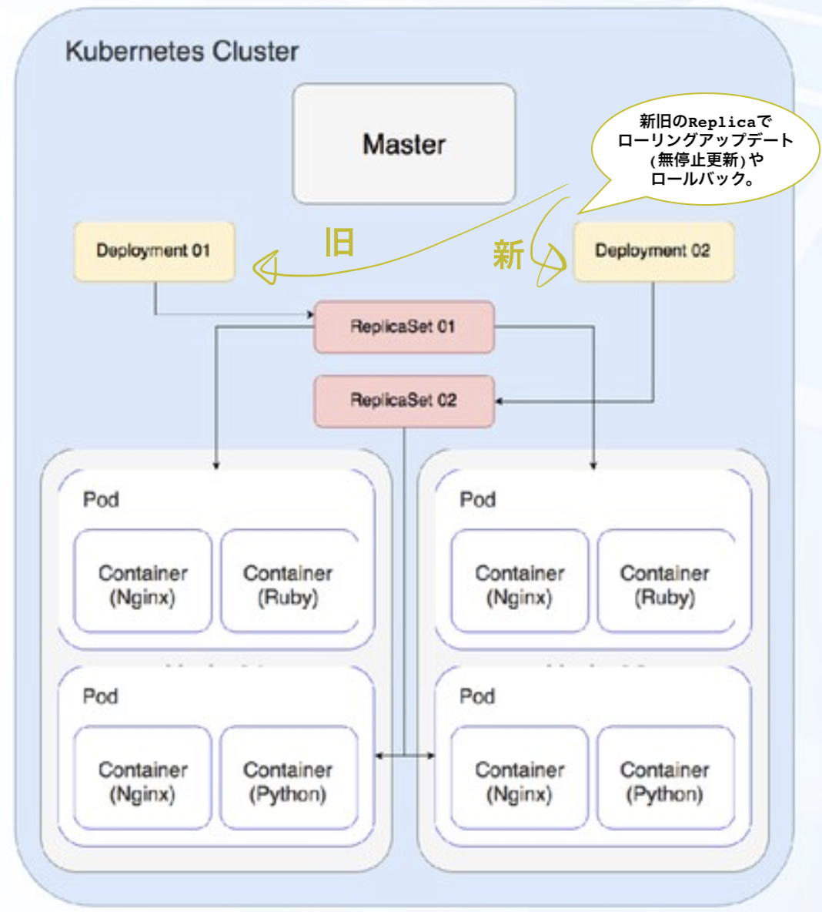

```sh
#ã¾ãšã¯Podã‚’Deploymentã¨ã—ã¦1ã¤èµ·å‹•
kubectl run --image gcr.io/google-samples/hello-app:1.0 helloworld 

# deploymentをリストアップ
kubectl get deployment

# 3ã¤ã«ã‚¹ã‚±ãƒ¼ãƒ«ã‚¢ãƒƒãƒ—
kubectl scale --replicas=5 deploy/helloworld
```
- クラスター外ã®Macã‹ã‚‰ã€Deploymentã§é…ç½®ã•ã‚ŒãŸPodã«Curlã™ã‚‹ã¨æ¥ç¶šã§ãã‚‹
```
curl $(minikube service helloworld-nodeport --url)
```
- Deploymentをローリングアップデート
```sh
kubectl set image deploy/helloworld helloworld=gcr.io/google-samples/hello-app:2.0

# RollingUpdate中ã®HelloworldPodã‚’Curlã™ã‚‹ã¨ã€v1ã¨v2ã®ä¸¡æ–¹ã‹ã‚‰ResponseãŒè¿”ã£ã¦ãã‚‹
for i in {1..30}; do curl $(minikube service helloworld-nodeport --url); done

＃履歴ãƒã‚§ãƒƒã‚¯
kubectl rollout history deploy/helloworld

# ロールãƒãƒƒã‚¯
kubectl rollout undo deploy/helloworld  
```
- クリーンアップ
```
kubectl delete deploy helloworld
kubectl delete svc helloworld-clusterip
kubectl delete svc helloworld-nodeport
kubectl delete svc helloworld-lb
kubectl delete svc helloworld-v2-nodeport
kubectl delete -f ingress.yaml 
kubectl delete -f ingress_path.yaml 
```


---
NEXT > [5_K8s_Manifest_File](../5_K8s_Manifest_File/README.md)