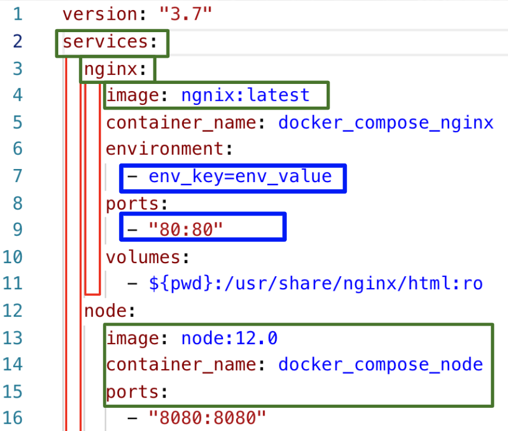
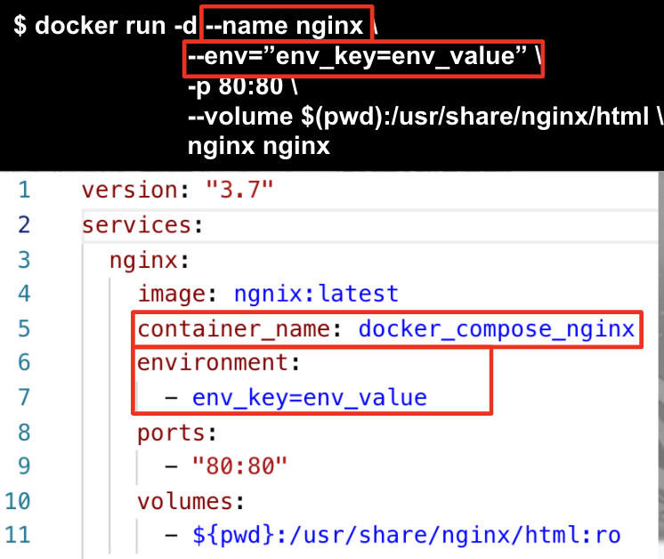
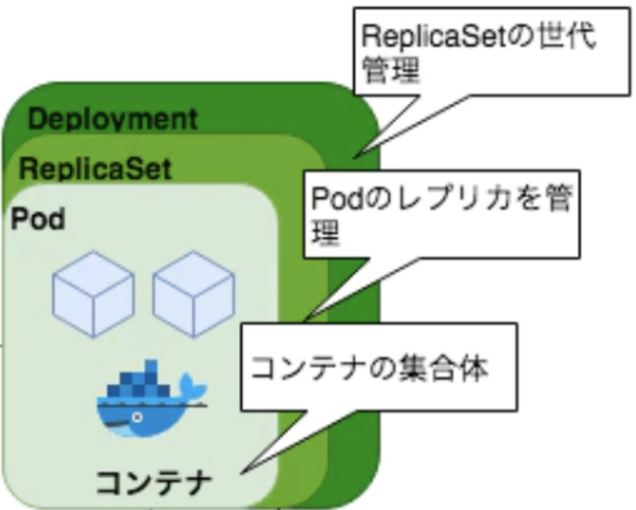

# 5. kubernetes manifest file anatomy

## 5.1 YAMLって何？
YAMLファイルは<strong>インデントで区切りをつける</strong>JSONの兄弟で、セミコロンでなくインデントを使うPythonに似てます

そして<strong>トップダウンのヒエラルキー</strong>になっていて、services→Nginx→imageというレベルで表現されます

さらに、YAMLは基本<strong>Key-Valueペアのマップ</strong>になっていて、- “80:80”のように”-”で始まるものだけリストになってます



---
## 5.2 Imperative(命令的) vs Declaretive(宣言的)の違いとは

<strong>Imperative(命令的,指示的)</strong>とは、いちいち細かくAlgorithm指示をすることです。

例えば、マンゴージュース２つ欲しい場合
```
マンゴージュース２つ作るために：
-　2つコップを用意して
-　マンゴーを2人分切って
-　切ったマンゴーをブレンダーでミックスして
-　最後に2つのコップに分ける
```

Imperative(命令的,指示的)なJavaのforループ例です。この場合、How（iの変数でループ）を指定しています。
```
for (int i = 0; i < nums.length; i++) 
```

<strong>Declarative(宣言的)</strong>は、やり方は気にせず、最終の状態だけを定義することです。
```
マンゴージュース２つ欲しい　
```

Declarative(宣言的)なJavaのforループ例です。この場合、How（iの変数でループ）を気にしてません。
```
for (int num : nums)
```

YAMLに宣言的に最終の状態を定義することで、それを達成するためのHowを抽象化するのがメリットです。また、YAMLをGitにコミットすれば、インフラの状態をコード化できるので、DevOpsの<strong>IaC（Infrastructure as a Code）</strong>の流れにも乗っ取っています。


### 5.2.1 docker runからDocker-Composeへ
Docker runコマンドをDocker-composeに変換することができます

オプションである`--name`, `--env`,  `-p`, `--volume`はそれぞれYAMLでもマッピングされてます




### 5.2.2 kubectl runからkubernetes yamlへ (imperative to declaretive) 

YAMLを自動生成してくれるお役立ちオプション`--dry-run -o yaml`を使おう

#### BEFORE: Imperative　(命令的,指示的)
- Pod
```
kubectl run \
    --image gcr.io/google-samples/hello-app:1.0 \
    --restart Never \
    helloworld
```
- Service 
```
kubectl expose pod helloworld \
    --type ClusterIP \
    --port 8080 \
    --name helloworld-clusterip
```
- Deployment
```
kubectl run \
    --image gcr.io/google-samples/hello-app:1.0 \
    helloworld 
```

#### AFTER: Declaretive(宣言的)
- Pod
```
kubectl run \
    --port 8080 \
    --image gcr.io/google-samples/hello-app:1.0 \
    --restart Never \
    --dry-run \
    -o yaml \
    helloworld > pod.yaml
```
- Service 
```
kubectl expose pod helloworld \
    --type ClusterIP \
    --port 8080 \
    --name helloworld-clusterip \
    --dry-run \
    -o yaml > service.yaml
```
- Deployment
```
kubectl run \
    --port 8080 \
    --image gcr.io/google-samples/hello-app:1.0 \
    --dry-run \
    -o yaml \
    helloworld > deployment.yaml
```

コツは`kubectl run --restart`オプションです。
```
--restart Never => Pod
--restart Always => Deployment
--restart OnFailure => Job
```

YAMLができたらあとは`kubectl apply -f`を使って起動・停止します

- YAMLに定義されたリソースを作成する
```
kubectl apply -f pod.yaml
```
- YAMLに定義されたリソースを削除する
```
kubectl delete -f pod.yaml
```

---
## 5.3 kubernetes pod yamlで複数コンテナを起動しよう
まずはPodのYAMLテンプレートを生成
```
kubectl run \
    --port 8080 \
    --image busybox \
    --restart Never \
    --dry-run \
    -o yaml \
    --command \
    helloworld \
    -- /bin/sh -c "sleep 500" > pod_multi_containers.yaml
```

コンテナを2つ定義
```
containers:
  - command:
    - /bin/sh
    - -c
    - sleep 500
    image: busybox
    name: sleep
    ports:
    - containerPort: 80
  - image: gcr.io/google-samples/hello-app:1.0
    name: helloworld
    ports:
    - containerPort: 8080
```

- YAMLに定義されたリソースを作成する
```
kubectl apply -f pod_multi_containers.yaml
```

Pod内にある2つのコンテナのログを1つずつ表示する
```
kubectl logs helloworld --container helloworld
kubectl logs helloworld --container sleep
```

---
## 5.4 kubernetes deployment yamlでPodを大量生産してみよう
まずはDeploymentのYAMLテンプレートを生成
```
kubectl run \
    --port 8080 \
    --image busybox \
    --replicas 5 \
    --dry-run \
    -o yaml \
    --command \
    helloworld \
    -- /bin/sh -c "sleep 500" > deployment_multi_containers.yaml
```

コンテナを2つ定義
```
containers:
  - command:
    - /bin/sh
    - -c
    - sleep 500
    image: busybox
    name: sleep
    ports:
    - containerPort: 80
  - image: gcr.io/google-samples/hello-app:1.0
    name: helloworld
    ports:
    - containerPort: 8080
```

- YAMLに定義されたリソースを作成する
```
kubectl apply -f deployment_multi_containers.yaml

kubectl get pod,deployment
```

---
## 5.5 PodとDeploymentマニフェストの比較
２つのYAMLを見ると、Podが定義されているブロックがDeploymentにあるのがわかります。

よって、DeploymentはPodのWrapperであることがわかります。



---
NEXT > [6_K8s_Storage](../6_K8s_Storage/README.md)