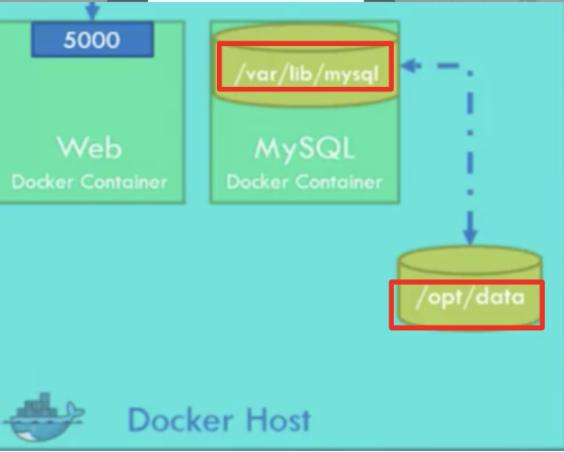
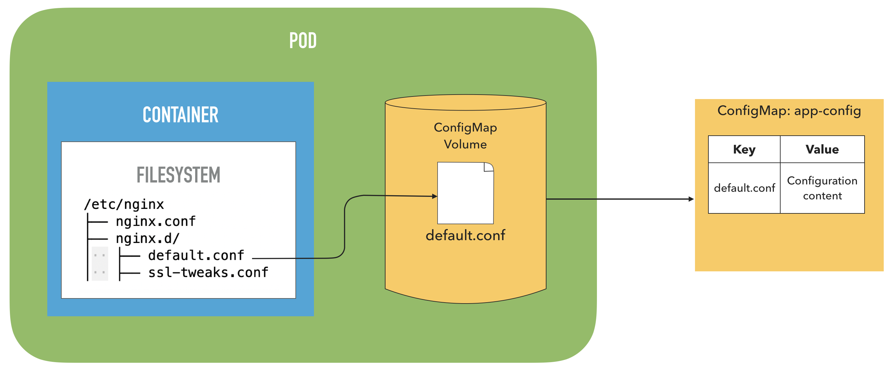
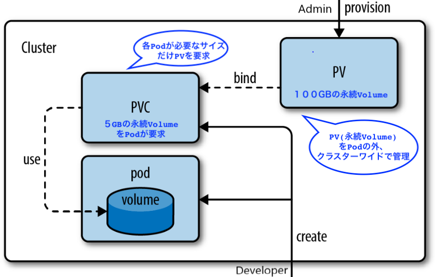

# 6. KubernetesのStorage


## 6.1 環境変数をConfig Mapで定義して、Podで引用
ConfigMapは環境変数などをKey Valueペアとして保存するリソースです。PodやDeploymentマニフェストに直接環境変数を定義してもいいですが、静的な定義で、Podが稼働中にDynamicに変更ができません。またReuseもできないので、ConfigMapを使うのがベストです。

### BEFORE:

`-o yaml`オプションで`--env TEST_ENV=Hello_World`を含んだYAMLを生成しファイルに保存
```
kubectl run \
    --env TEST_ENV=Hello_World \
    --port 8080 \
    --image gcr.io/google-samples/hello-app:1.0 \
    --restart Never \
    --dry-run \
    -o yaml \
    helloworld > pod_env.yaml
```

YAMLを見てみると `- env:`が定義されてるのがわかる
```
apiVersion: v1
kind: Pod
metadata:
  creationTimestamp: null
  labels:
    run: helloworld
  name: helloworld
spec:
  containers:
  - env:
    - name: TEST_ENV
      value: Hello_World
    image: gcr.io/google-samples/hello-app:1.0
    name: helloworld
    ports:
    - containerPort: 8080
    resources: {}
  dnsPolicy: ClusterFirst
  restartPolicy: Never
```

### AFTER:

### ConfigMapからコンテナ内に環境変数をInject
まずはConfigMapをYAMLで定義
```
kubectl create configmap my-config \
    --from-literal=TEST_ENV=Hello_World \
    --dry-run \
    -o yaml > configmap.yaml
```

ConfigMapのYAMLを見てみる
```
apiVersion: v1
data:
  TEST_ENV: Hello_World
kind: ConfigMap
metadata:
  creationTimestamp: null
  name: my-config
```


ConfigMapのYAMLを元にリソースを作成
```
kubectl apply -f configmap.yaml 

# ConfigMapをリストアップ
kubectl get configmap
NAME        DATA   AGE
my-config   1      14s
```

ConfigMap `my-config`の詳細を表示
```
kubectl describe configmap my-config
```

Output
```
Name:         my-config
Namespace:    default
Labels:       <none>
Annotations:  kubectl.kubernetes.io/last-applied-configuration:
                {"apiVersion":"v1","data":{"TEST_ENV":"Hello_World"},"kind":"ConfigMap","metadata":{"annotations":{},"creationTimestamp":null,"name":"my-c...

Data
====
TEST_ENV:
----
Hello_World
Events:  <none>
```

次にPodマニフェストで、環境変数をConfigMapから引用するよう定義
[pod_configmap_env.yaml](pod_configmap_env.yaml)
```
apiVersion: v1
kind: Pod
metadata:
  creationTimestamp: null
  labels:
    run: helloworld
  name: helloworld
spec:
  containers:
  - env:
    # 環境変数の名前を定義
    - name: TEST_ENV
      valueFrom:
        configMapKeyRef:
          # ConfigMapの名前を指定
          name: my-config
          # ConfigMapのKeyを指定
          key: TEST_ENV
    image: gcr.io/google-samples/hello-app:1.0
    name: helloworld
    ports:
    - containerPort: 8080
    resources: {}
  dnsPolicy: ClusterFirst
  restartPolicy: Never
status: {}
```

Podを作成
```
kubectl apply -f pod_configmap_env.yaml
```

Pod内の環境変数を確認
```
kubectl exec -it helloworld-configmap-env env
```

---
## 6.2 ConfigMapからPod内にVolumeマウント

まず最初に、ドッカーのVolumeマウントをおさらいします。

コンテナは蛍の光のように儚いライフサイクルなので、データはコンテナ内ではなくホスト上に保存します。



Docker runコマンドで
`--volume /opt/datadir:/var/lib/mysql`のようにホスト上のフォルダーとコンテナ内のフォルダーを指定して、Volumeをマウントします。

K8sの場合、Podが管理上の基本単位であり、仮想NICを共有（同じIP、同じVolumeファイルシステム）することを学びました。つまり、Pod は Kubernetes 上でホストに相当する単位です。

なので、コンテナがホストのVolumeを共有するということは、コンテナがPod上のVolumeで読み書きをするということです。


### ConfigMapからコンテナ内にVolumeマウント
ConfigMapでは、環境変数だけではなく、単純にKey Valueペアを保存してそのデータをファイルとしてVolumeマウントすることもできます。使用例は、SSL key だったり、パスワードだったりします。




Podマニフェストで ConfigMapをVolumeとしてマウントするように定義

[pod_configmap_volume.yaml](pod_configmap_volume.yaml)
```
    volumeMounts:
      # Volume名を指定
    - name: my-config-volume
      # Volumeをマウントするコンテナ内のファイルパスを指定
      mountPath: /my-config/TEST_ENV
  volumes:
    # 作成するVolume名を指定
    - name: my-config-volume
      configMap:
        # ConfigMap名を指定
        name: my-config
        items:
        # ConfigMap内にあるKeyの名前をして
        - key: TEST_ENV
          path: keys
```

Podを作成
```
kubectl apply -f pod_configmap_volume.yaml
```

Pod内のファイルシステムを確認
```
$ kubectl exec -it helloworld-configmap-volume sh

$ ls /my-config/TEST_ENV
$ cat my-config/TEST_ENV/keys
Hello_World
```

---
## 6.3　TLSサーティフィケートやトークンをSecretとしてConfig Mapで定義
SecretはBase64でエンコードして、Key Valueペアとして保存するリソースです。Base64なので、Encryptionとは違い誰でもDecodeできるので、DB PasswordなどはSecretに保存するべきではありません。

Secretの作成方法はConfigMapとほぼ同じです。

まずは`--help`を使って使用例を見てみます。
```
kubectl create secret --help
```

便利コマンドである`--dry-run`で仮実行し、 `-o yaml`でマニフェストを生成します。
```
$ kubectl create secret generic my-secret \
  --from-literal=SECRET_KEY1=SECRET_VALUE1 \
  --from-literal=SECRET_KEY2=SECRET_VALUE2 \
  --dry-run -o yaml

apiVersion: v1
data:
  SECRET_KEY1: U0VDUkVUX1ZBTFVFMQ==
  SECRET_KEY2: U0VDUkVUX1ZBTFVFMg==
kind: Secret
metadata:
  creationTimestamp: null
  name: my-secret
```

マニフェストを確認したら、`secret.yaml`に保存します。
```
kubectl create secret generic my-secret \
  --from-literal=SECRET_KEY1=SECRET_VALUE1 \
  --from-literal=SECRET_KEY2=SECRET_VALUE2 \
  --dry-run -o yaml > secret.yaml
```

マニフェストからSecretを作成
```
kubectl apply -f secret.yaml
```

SecretをYAMLで表示したり、詳細を確認
```
kubectl get secret -o yaml
kubectl describe secret my-secret
```

Base64でdecodeすると、元のValueが確認できる
```
$ echo U0VDUkVUX1ZBTFVFMQ== | base64 --decode

SECRET_VALUE1
```
 
---
## 6.4 SecretをVolumeとしてPodにマウント

次にPodマニフェストで、Secretから引用するよう定義
[pod_secret_volume.yaml](pod_secret_volume.yaml)
```
apiVersion: v1
kind: Pod
metadata:
  creationTimestamp: null
  labels:
    run: helloworld-secret-volume
  name: helloworld-secret-volume
spec:
  containers:
  - image: gcr.io/google-samples/hello-app:1.0
    name: helloworld-secret-volume
    ports:
    - containerPort: 8080
    resources: {}
    volumeMounts:
      # Volume名を指定
    - name: my-secret-volume
      # Volumeをマウントするコンテナ内のファイルパスを指定
      mountPath: /my-secret
      readOnly: true
  volumes:
    # 作成するVolume名を指定
    - name: my-secret-volume
      secret:
        # Secret名を指定
        secretName: my-secret
```

Podを作成
```
kubectl apply -f pod_secret_volume.yaml
```

Pod内のSecretのValueを確認
```
kubectl exec -it helloworld-secret-volume cat /my-secret/SECRET_KEY1
```


### しかしこのVolumeに問題が！
しかし、Podは仮想ホストの働きをしますがいつ消えてなくなるかわかりません。ConfigMapやSecretをVolumeとしてReadOnlyでマウントするのは大丈夫ですが、<strong>データベースファイルなど</strong>を保存する場合、Podが消えるとデータが失われてしまいます。

そこで、データをPodでなくNode上に保存するPersistent volume（永続ボリューム）の登場です。


---
## 6.5 Persistent volume (on node)　PVC（永続ボリューム要求）

コンテナが書くデータをPod内のVolumeでなく、クラスターワイドのNode上に存在するPersistent volume（永続ボリューム）に保存することで、Podが消えてもデータはクラスター上に残ります。



- Nodeにsshして入り、`/mnt/pvc/hello_world.txt`を作成
```
minikube ssh
sudo mkdir mnt/pvc
echo "Hello World" > mnt/pvc/hello_world.txt
```

- PVを作成
```
kubectl apply -f persistent_volume.yaml 

kubectl describe pv pv
```

- PVCを作成
```
kubectl apply -f persistent_volume_claim.yaml

kubectl get pvc
NAME   STATUS   VOLUME                                     CAPACITY   ACCESS MODES   STORAGECLASS   AGE
pvc    Bound    pvc-2bf4b736-f746-46b5-aa27-31c5a5191f8b   10M        RWO            standard       4s
```

- PVをリストアップすると `pvc-2bf4b736-f746-46b5-aa27-31c5a5191f8b 　10M RWO  Delete  Bound`となってるのがわかる
```
kubectl get pv
NAME                                       CAPACITY   ACCESS MODES   RECLAIM POLICY   STATUS      CLAIM         STORAGECLASS   REASON   AGE
pv                                         100M       RWO            Retain           Available                                         95s
pvc-2bf4b736-f746-46b5-aa27-31c5a5191f8b   10M        RWO            Delete           Bound       default/pvc   standard                8s
```

- PVCをVolumeとしてマウントするPodを作成
```
kubectl apply -f pod_pvc.yaml 
```

- Pod内のコンテナにシェルで入り、ファイルを`/mnt/pvc/from_pod.txt`上に作成
```
k exec -it helloworld-pvc sh
echo "from pod" > /mnt/pvc/from_pod.txt
cat /mnt/pvc/from_pod.txt
```

- Nodeにsshして入り、Pod内のコンテナで作成した`/mnt/pvc/from_pod.txt`がNode上にあることを確認
```
minikube ssh
cat /mnt/pvc/from_pod.txt 
```


## クリーンアップ
```
kubectl delete -f pod_configmap_volume.yaml
kubectl delete -f pod_configmap_env.yaml 
kubectl delete -f pod_env.yaml 

kubectl delete -f pod_pvc.yaml
kubectl delete -f persistent_volume_claim.yaml 
kubectl delete -f persistent_volume.yaml 
```


---
NEXT > [7_K8s_Networking](../7_K8s_Networking/README.md)