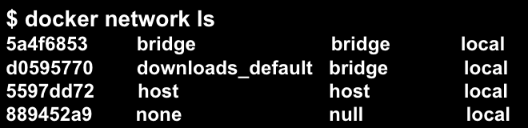
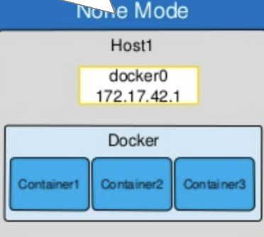
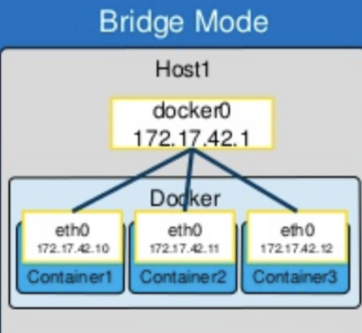
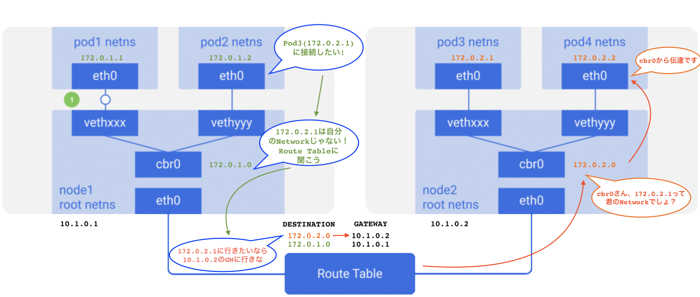

# 7. Kubernetes Networking

## 7.1 Create Namespace (kubectl create namespace test)
1つのクタスター内で、仮想のクラスターに分けられる
開発、運用、テスト環境をNamespaceで分ける

```
kubectl get namespace

kubectl create namespace staging

kubectl run \
    --image gcr.io/google-samples/hello-app:1.0 \
    --restart Never \
    --namespace staging \
    helloworld

kubectl get pod --namespace default

kubectl get pod --namespace staging

kubectl delete namespace staging
```


## 7.2 4つのDockerネットワークモードをおさらい
ちなみに、Docker networkには4つモードがあり、デフォルトのBridge、host、null、overlayがあります



- ネットワークを表示する
```
docker network ls
```
- ネットワークを--driverオプションで作成する
```
docker network create --driver bridge custom_bridge
```
- ネットワークを削除する
```
docker network rm custom_bridge
```

### 7.2.1 None network
Noneモードの場合、コンテナはBridgeにもHostネットワークにもリンクされずIPもないので、接続不可の無人島状態になります。


```
docker run --network=none --rm -d --name none -p 80:80 nginx
docker inspect none

curl localhost:80
```

### 7.2.2 Bridge network (default)
Bridgeモードの場合、ホストの中のDockerBridgeネットワークからIPが振り分けられるので、IPレンジがホストと異なります



```
docker run --rm -d --name bridge -p 81:80 nginx
docker inspect bridge

curl localhost:81
```

### 7.2.3 Host network
Hostモードの場合、ホストのIPレンジからIPが振り分けら、ホストポートを使うので


```
docker run --network=host --rm -d --name host  -p 82:80 nginx
docker inspect host

# for Mac, it doesn't work
# ref: https://forums.docker.com/t/should-docker-run-net-host-work/14215
curl localhost:81
```

### 7.2.4 Overlay network (multi-host environment)
最後のOverlayモードは、複数ホストがあるときに使います。Docker SwarmやKubernetesが複数ホストのケースです。


### 7.3 multi-host overlay network (route table)


OverlayネットワークPluginの実装はAdminに任されます。例えばAWS EKSの場合、AWS VPC CNIというのがデフォルトで実装されてます。

他にも、
- Calico
- Weaves
など有名なCNI Pluginがあります。

---
NEXT > [8_Other_Tools](../8_Other_Tools/README.md)