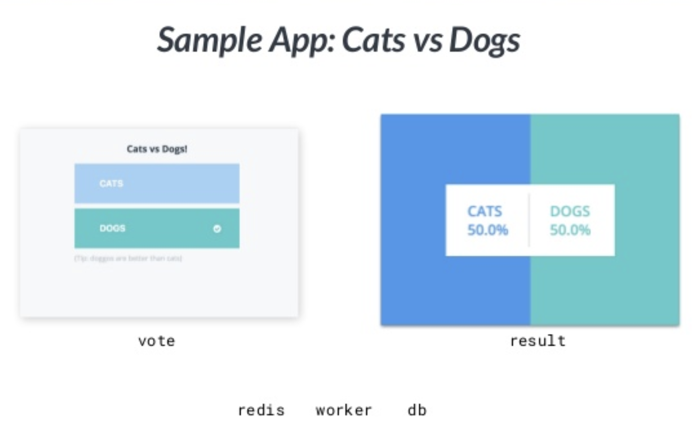
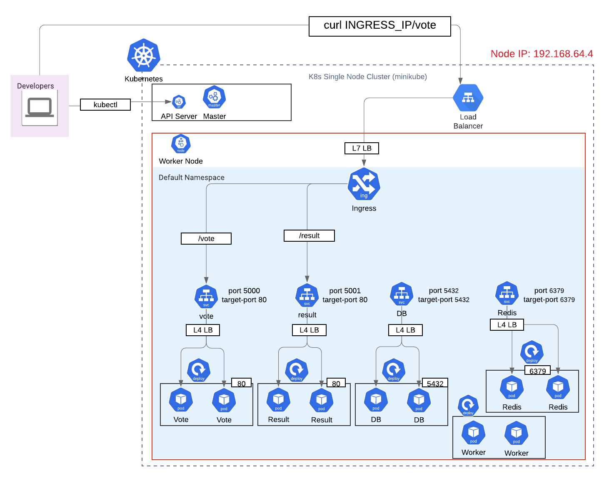
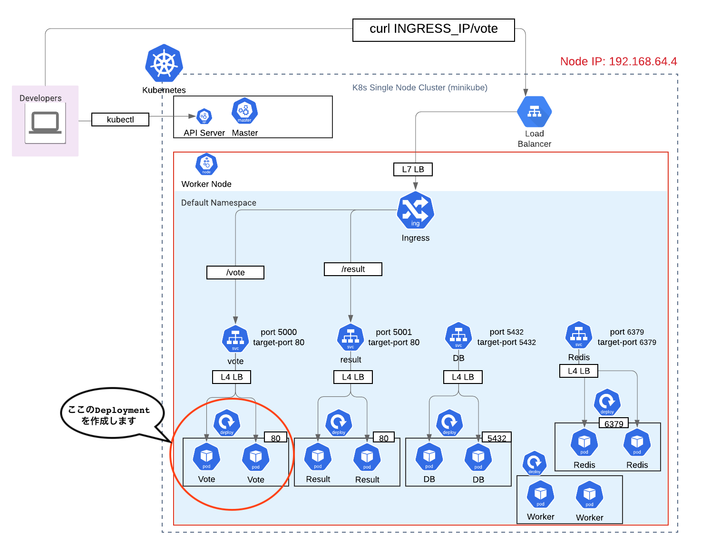
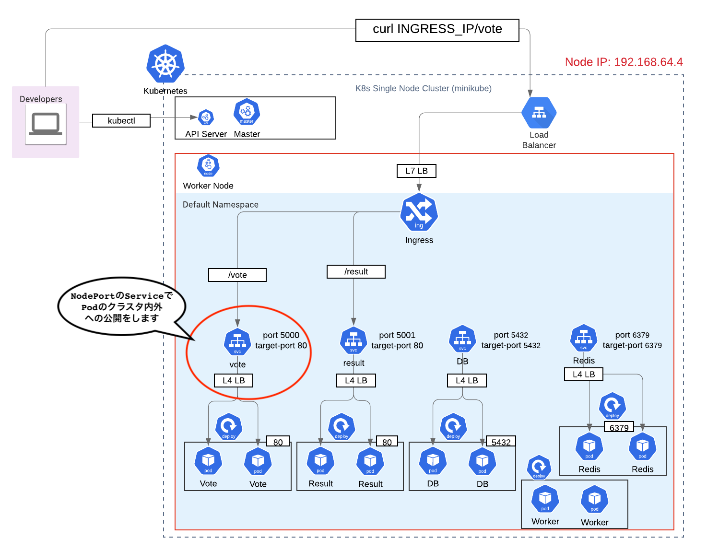
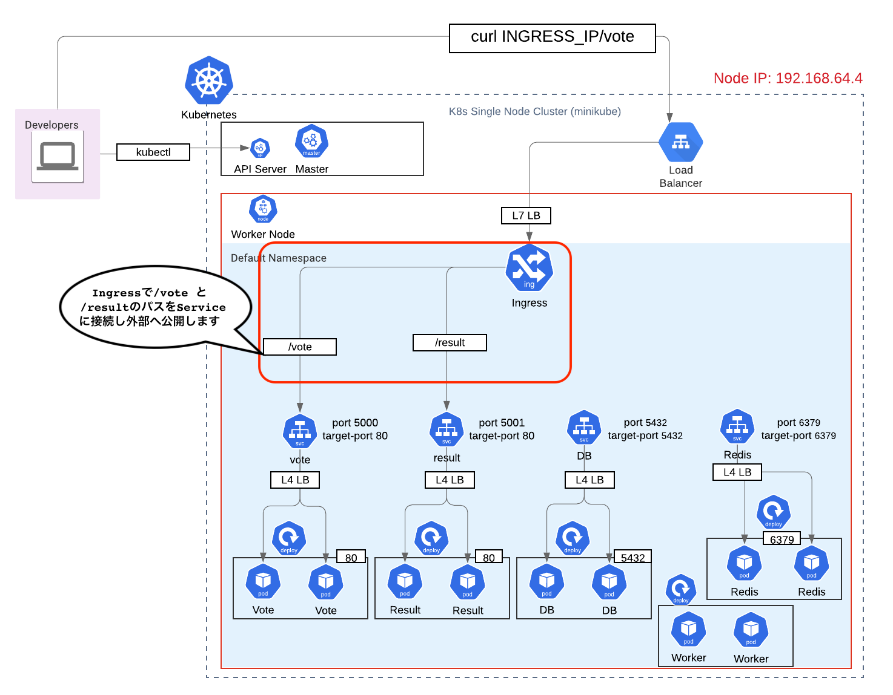

# 9. WebアプリをK8sクラスターにDeployし構築しよう

WebアプリのGUIはこんな感じです。


コンテナ間の関係性です。


K8sクラスターでこのようなアーキテクチャを構築します。



サンプルアプリのVoting Appはすでにクローン済み (Clone the repo)
```
git clone https://github.com/dockersamples/example-voting-app.git
```

## 1. サンプルアプリのVoting Appの[example-voting-app/docker-compose-k8s.yml](example-voting-app/docker-compose-k8s.yml)をチェック
```
version: ':8080'

services:
  redis:
    image: redis:alpine
    ports:
      - "6379:6379"
  db:
    image: postgres:9.4
    environment:
      POSTGRES_USER: "postgres"
      POSTGRES_PASSWORD: "postgres"
    ports:
      - "5432:5432"
  vote:
    image: dockersamples/examplevotingapp_vote:before
    ports:
      - "5000:80"
    deploy:
      replicas: 2
  result:
    image: dockersamples/examplevotingapp_result:before
    ports:
      - "5001:80"
  worker:
    image: dockersamples/examplevotingapp_worker
  visualizer:
    image: dockersamples/visualizer:stable
    ports: 
      - "8080:8080"
```

# 2. ハンズオンチャレンジ

以下のK8sリソースを作りましょう。　
1. `vote` Deployment
    - container port `80`
    - image `dockersamples/examplevotingapp_vote:before`
    - replica `2`
2. `vote` Service
    - service port `5000`
    - target port `80`
    - service type `NodePort`
3. `result` Deployment
    - container port `80`
    - image `dockersamples/examplevotingapp_result:before`
    - replica `1`
2. `result` Service
    - service port `5001`
    - target port `80`
    - service type `NodePort`
4. `db` Deployment
    - container port `5432`
    - image `postgres:9.4`
    - replica `1`
    - 環境変数 "POSTGRES_USER=postgres"
    - 環境変数 "POSTGRES_PASSWORD=postgres"
5. `db` Service
    - service port `5432`
    - target port `5432`
    - service type `ClusterIP`　　# ナゼ？ DBは外部に公開するべきでないから
6. `redis` Deployment
    - container port `6379`
    - image `redis:alpine`
    - replica `1`
7. `redis` Service
    - service port `6379`
    - target port `6379`
    - service type `ClusterIP` # ナゼ？ DBは外部に公開するべきでないから
8. `worker` Deployment
    - image `dockersamples/examplevotingapp_worker`
    - replica `1`
9. `ingress` Ingress
    - `/vote`　パスを `vote` service の port `5000`　へ接続
    - `/result` パスを　`result` service の port `5001`　へ接続

---
# 解答の解説
## 3. voting コンテナをDeployment & Serviceへ変換


```
kubectl run \
  --image dockersamples/examplevotingapp_vote:before \
  --port 80 vote \
  --dry-run \
  -o yaml > deployment_vote.yaml

kubectl apply -f deployment_vote.yaml
```

Serviceへ変換

```
kubectl expose deploy vote \
  --port 5000 \
  --target-port 80 \
  --type NodePort \
  --dry-run -o yaml > service_vote.yaml
```

## 4. result コンテナをDeployment & Serviceへ変換
```
kubectl run \
  --image dockersamples/examplevotingapp_result:before \
  --port 80 result \
  --dry-run \
  -o yaml > deployment_result.yaml

kubectl apply -f deployment_result.yaml

kubectl expose deploy result \
  --port 5001 \
  --target-port 80 \
  --type NodePort \
  --dry-run -o yaml > service_result.yaml
```

## 5. worker コンテナをPodへ変換
```
kubectl run \
  --image dockersamples/examplevotingapp_worker \
  worker \
  --dry-run \
  -o yaml > deployment_worker.yaml

kubectl apply -f deployment_worker.yaml
```

## 6. db コンテナをDeployment & Serviceへ変換
```
kubectl run \
  --image postgres:9.4 \
  --port 5432 \
  --env POSTGRES_USER=postgres \
  --env POSTGRES_PASSWORD=postgres \
  db \
  --dry-run \
  -o yaml > deployment_db.yaml

kubectl apply -f deployment_db.yaml

kubectl expose deploy db \
  --port 5432 \
  --target-port 5432 \
  --type ClusterIP \
  --dry-run -o yaml > service_db.yaml
```

## 7. redis コンテナをDeployment & Serviceへ変換
```
kubectl run \
  --image redis:alpine \
  --port 6379 \
  redis \
  --dry-run \
  -o yaml > deployment_redis.yaml

kubectl apply -f deployment_redis.yaml

kubectl expose deploy redis \
  --port 6379 \
  --target-port 6379 \
  --type ClusterIP \
  --dry-run -o yaml > service_redis.yaml
```

## 8. 全てのリソースを作成
```
kubectl apply -f deployment_vote.yaml
kubectl apply -f service_vote.yaml
kubectl apply -f deployment_result.yaml
kubectl apply -f service_result.yaml
kubectl apply -f deployment_db.yaml
kubectl apply -f service_db.yaml
kubectl apply -f deployment_redis.yaml
kubectl apply -f service_redis.yaml

kubectl apply -f deployment_worker.yaml
```

## 9. VoteとResult　Serviceの Node IPとNode Portを取得

- IPを取得
```
echo $(minikube ip service vote):$(kubectl get svc vote -o jsonpath='{.spec.ports[0].nodePort}')

echo $(minikube ip service result):$(kubectl get svc result -o jsonpath='{.spec.ports[0].nodePort}')
```


## 10. Ingressリソースを作成


```sh
kubectl apply -f ingress_vote.yaml
kubectl apply -f ingress_result.yaml

# IngressのIPを取得
kubectl get ingress -o=jsonpath='{.items[0].status.loadBalancer.ingress[0].ip}'
```

- https://stackoverflow.com/questions/49514702/kubernetes-ingress-with-multiple-target-rewrite
- https://stackoverflow.com/questions/53625500/kubernetes-ingress-path-not-finding-resources


## Cleanup
```
kubectl delete --all deployments --namespace=default
kubectl delete --all services --namespace=default
kubectl delete --all ingress --namespace=default
```


---
NEXT > [10_BONUS_Helm_Chart](../10_BONUS_Helm_Chart/README.md)